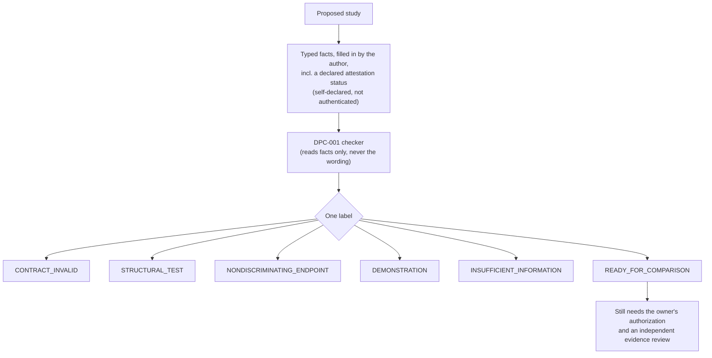

# VERITAS ORIGIN

An experimental, self-evolving AI research node.

Status: EARLY PROTOTYPE — NOT VALIDATED.

Objectives:
- Generate falsifiable research hypotheses.
- Run controlled experiments.
- Preserve observations, failures, and provenance.
- Evaluate candidate improvements independently.
- Develop a small-model research engine.
- Publish reproducible research and accompanying lessons.

Autonomous proposals are not authorization to deploy changes.

## Current research status: DPC-001 (as of 2026-10-09)

DPC-001 is a *precheck*: before a study runs, it sorts the study's design into one of six labels, so weak or misleading experiments are caught early. Everything below is on PR [#25](https://github.com/holland202/veritas-origin/pull/25) (v0.2) and PR [#24](https://github.com/holland202/veritas-origin/pull/24) (v0.1), and none of it is merged into the code on `main`.

| Item | Status |
|---|---|
| v0.2 specification | **FROZEN** at `bc43adf` (sha256 `fce85463…`) |
| v0.2 checker | **FROZEN** at `bc43adf` (sha256 `f2746a43…`) |
| Blind evaluation 1 | **FAILED**: 23 of 24 (preregistered rule: 24 of 24) |
| Blind evaluation 2 | **PASSED**: 24 of 24, new cases, including invalid-schema coverage (owner-run; does not replace run 1) |
| Cause of the failure | **Test-author error** in case T01; the checker's answer was correct for the input it got |
| Blind coverage | Invalid-schema rejection, missed in run 1, was covered in run 2 |
| v0.1 checker | **FAILED** a robustness test (rewording changed its answers); kept as a negative result |
| Independent validation | **Not established** |
| Production readiness | **Not ready** |

Each result keeps three things apart: **what was observed** → **what caused it** → **what that does and doesn't validate**.

### How a study design moves through DPC-001

Only READY_FOR_COMPARISON and NONDISCRIMINATING_ENDPOINT require the declared attestation to be `ATTESTED` with a linked artifact. The checker can't tell whether that declaration is true.

### How DPC-001 got here

```mermaid
flowchart LR
    S1["v0.1 spec frozen"] --> C1["v0.1 checker<br/>visible tests 20/20"]
    C1 --> P1["Reworded cases:<br/>kept 1 of 8"]
    P1 --> X1["v0.1 FAILED<br/>(kept)"]
    X1 --> S2["v0.2: decide from typed facts"]
    S2 --> F2["Frozen bc43adf<br/>(owner-verified hashes)"]
    F2 --> B1["Blind run 1<br/>23/24 = FAIL"]
    B1 --> RC["Cause: T01 test-author error<br/>(confirmed by unsealing)"]
    RC --> G["Pre-seal gate added"]
    G --> M1["Gate catches T03 error<br/>before sealing (M1)"]
    M1 --> B2["Blind run 2<br/>24/24 = PASS"]
```

### Blind evaluation 1, in full

| Measure | Result |
|---|---|
| Cases run | 24 (one authorized run, on the owner's phone) |
| Matched the expected answer | 23 |
| Mismatched | 1 (T01: expected CONTRACT_INVALID, got READY_FOR_COMPARISON) |
| Preregistered outcome | **FAIL**, not rescored |
| Root cause | T01 was identical to T09 apart from its name; the intended broken schema was never applied |
| Commitments | Recomputed after unsealing; match the fingerprints posted before the run |
| Lesson kept | A pre-seal integrity gate (`coordination/dpc001_v02/preseal_gate.py` on PR #25) now catches this class of test error before sealing |

### Blind evaluation 2

| Measure | Result |
|---|---|
| Cases run | 24 new cases (one authorized run, on the owner's phone), including invalid-schema cases |
| Pre-seal gate | First draft **FAILED** the gate (T03: expected a missing study id, but one was present); corrected set PASS (0 fail, 0 warn) |
| Matched the expected answer | 24 of 24 |
| Preregistered outcome | **PASS** |
| Evidence | sha256 `78bca603…`; commitments cases `6ea0e754…`, oracle `e2927f11…` |
| Not yet done | Independent inspection of the run-2 reason-code evidence; unsealing for public audit |

**Finding DPC-001-M1, pre-seal error interception.** Run 1's failure came from a test-writing error that was found only after the run. The gate built from that failure caught an error of the same kind in run 2's first draft, before sealing. That was observed once, for one class of error. The improvement came from the research process, not from any AI learning on its own. Details: `coordination/dpc001_v02/FINDING_M1.md` on PR #25.

What the two runs together show: the frozen checker gave the expected label on 47 of 48 blind cases written by an AI that had read its code, and the one miss was a test error. That is evidence, not validation. No one outside the project has yet tried to break it.

Why 23 of 24 is not a pass: the rule was set before the run, and changing it afterwards would mean the test can't fail. The failure is real information about the test process, and it stays on the record.

*Status section drafted by Claude (Opus 5.5) at Chad Holland's direction, 2026-10-09, from a layout suggested by ChatGPT. Chad reviews it before it is merged.*

## Research preservation
Original research records must never be silently modified or deleted.
Each experiment must retain its inputs, outputs, method,
environment, source revision, evidence status,
and relevant hashes.

## Research sources
Principia Artificialis, Sovereign Veritas,
Local Discovery Engine, Sovereign Logic Core,
Evidence Ledger, EACE, and Veritas Companion
are independent projects, not bundled or
validated components.
