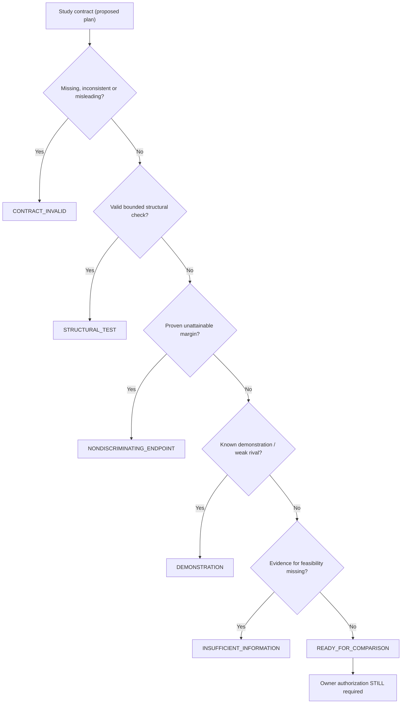
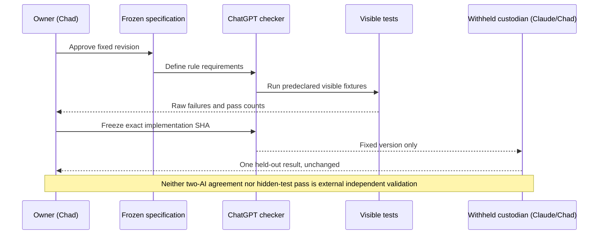

# DPC-001 visual guide — experimental checker candidate

> **Not a scientific result, not authorization, and not evidence of validity.**
> Frozen specification: `d05501013c7b2d0c602893e44d157620b55f12ff`.
> Checker candidate: `coordination/checkers/dpc001_checker.py`.
> Six withheld cases remain entirely outside this branch and ChatGPT's context.

## Simple view

## Technical view

The checker consumes a **declared contract**, not experiment outputs. Classification follows the frozen ordering in specification §2. Natural-language detection rules are intentionally limited and may misclassify unforeseen wording; any matching of an analytic bound is a check of a **declared** bound, not an independent mathematical proof.

**Review gate:** This branch is a draft implementation for critique. The visible harness is in PR #20, not merged into main. Do not run or reveal withheld cases until the separate owner-approved freeze and acceptance step. Preserve all mistakes and revisions in Git history.
