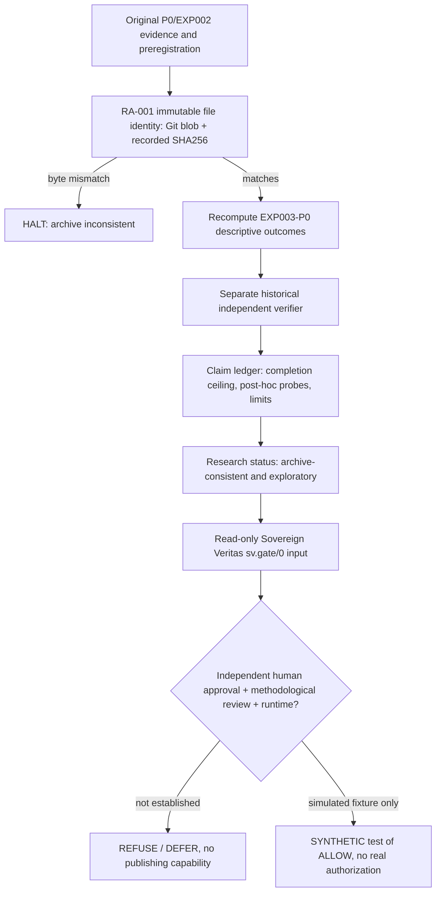

# RA-001 — Historical preservation and Sovereign Veritas authorization results

**Observed 2026-10-08. Engineering assurance only; scientific novelty, real-world truth and production security NOT VALIDATED.**

## Registration and source inventory

- Prospective controls: [`docs/RESEARCH_ASSURANCE_PROTOCOL.md`](RESEARCH_ASSURANCE_PROTOCOL.md), first committed at `5225afb17f6c9db4dc87bf04b36d9f00c825468f` **before RA-001 code and test outcomes**.
- Baseline GitHub `main` revision at registration: `2131d9166deea94811155a746e57fb597491f53a`.
- GitHub `main` was observed `protected=false`, `rulesets=[]`. Branch-protection changes **not possible through the available connector**, so this remains an unresolved administration requirement.
- Existing EXP003-P0 original SHA256: `627eb778e8eef80d9d664c9ac6f3b7743d51e6a97a677eea8cac51e79b467333`; EXP002 original SHA256 `a5fe362571ea600485cabd6759542314f0e6562e36ea6330feeb06db187faf6c`.
- `tools/research_assurance.py` also pins Git SHA-1 **blob-object identities** for 12 historical artifacts (the original Pilot 001, EXP002, EXP003 evidence, EXP002/EXP003 prereg/threat documents, original reports, original runner/verifier, and newly frozen claim ledger). A Git blob identity is byte binding inside the repository, not an independent signature or proof of physical truth.
- The original EXP003-P0 pilot's claim ledger is [`claims/exp003_p0_claims.json`](../claims/exp003_p0_claims.json). The original historical files remain unchanged; classification is exploratory.

## Verification architecture

**No path from file integrity or `CONSISTENT` to automatically authorized deployment.** The approved-object lifecycle and actual cryptographic human approval do not exist in RA-001; the diagram describes required future controls, not a complete approval service.

## First completed CI outcome

[GitHub Actions run 37859014372](https://github.com/holland202/veritas-origin/actions/runs/37859014372), job `historical-preservation`:

- Original EXP002 verifier returned `CONSISTENT WITH EXP002 SPECIFICATION`.
- Original EXP003-P0 verifier returned `CONSISTENT WITH EXP003-P0 SPECIFICATION`.
- `python3 tools/research_assurance.py` returned **`ARCHIVE_CONSISTENT_ONLY`**, confirming 36 task/policy evaluations and 86 total probes, with 12/12 solves for each fixed/random/greedy arm.
- Existing EXP003 behavior/verifier tests: **17/17 passed**.
- Newly registered RA-001 tests: **28/28 passed** including positive intact-archive tests, deliberate tampering and deletion, changed source/protocol/report, false ledger arithmetic, duplicate-key/NaN failures, and actual SV Gate authorization controls.
- **Actual Sovereign Veritas kernel Gate** was checked out from MIT source at commit `709da9eb435cbfe06a1ca00427843b12c673ceb0`, then exercised as a real dependency in CI. No SV code was copied into VERITAS ORIGIN.
- `tools/sv_research_bridge.py --claim-id EXP003-P0-C02` returned an input with `capability.authorized=false`, `human_approval_verified=false`, `verification.status=INSUFFICIENT_EVIDENCE`, unknown runtime, and a claim-scoped digest. Verified as **`UNAUTHORIZED_REVIEW_INTENT_ONLY`**.
- Under explicitly **SYNTHETIC-ONLY** test modifications of capability, review, verification and runtime fields, the real Gate returned an `ALLOW` verdict, demonstrating that it is not vacuously refusing every packet. This is **not** a real approver, authenticated signature, or deployment permission.
- All original historical files remained unchanged.

## Bounded conclusions

**SUPPORTED BY THESE ENGINEERING TESTS:** the fixed historical byte identities are load-bearing for the registered archive; the claim ledger cannot silently become confirmatory; a hand-edited or missing historical artifact fails; the existing independent mathematical verifier is still callable; and the actual SV Gate refuses publication for the default unauthorized research intent.

**NOT ESTABLISHED:** prevention of all admin-level modifications, adversaries who replace both checker and manifests, outside-author replicated physics/world truth, actual signature-based human permission, evaluator/process isolation, one-effect atomicity, or protection of future **unregistered** evidence.

## Security and development blockers

1. **Owner action:** protect `main` with a GitHub ruleset. Block force pushes/deletions, require PRs, require the passing `historical-preservation` check, narrow bypass, and require genuine human review for historical evidence, promotion rules and evaluator changes if another authorized reviewer is available. Existing GitHub tool exposes no protection-setting mutation.
2. **Scope of frozen originals:** the code pins current Pilot 001, EXP002, EXP003-P0 and the new ledger. Future registered experiments (VSC-001/2/3 draft PRs) need **their own separately versioned archival manifests** before merge or publication. Do not silently add them to RA-001's historical baseline after seeing outcomes.
3. **Model/evaluator contamination:** EXP003-P0 external subprocess is **not** an OS sandbox; C1 needs a separate restricted evaluator and withheld reference information.
4. **Approval:** a future signed and scoped human review record must be verified out-of-band before a capability can become authorized. SV's Gate does not validate whether metadata is genuine. `ALLOW` from a synthetic test is not deployment consent.
5. **Second-person replication:** three author's own SV Gate implementations agreeing with its contract is useful consistency testing, not independent external validation.

## Next concrete work, conditional on review

Once branch protection and this CI foundation are reviewed, propose a separate evaluator-contamination attack suite and later pinned source/evidence publication on GitHub, Codeberg and Hugging Face. All new experiments remain bound to their original registration and negative outcomes. No repository writes, forced mirror pushes, or publication on external platforms occurred as part of RA-001.
