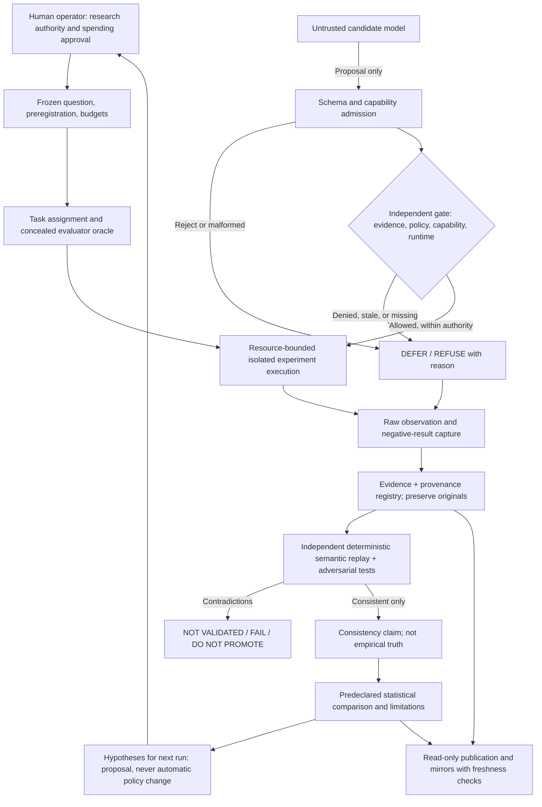

# VERITAS ORIGIN — Research-led system blueprint (v0.01)

**Document state:** PROPOSED ARCHITECTURE, not an implemented system.  
**Source baseline:** [VERITAS ORIGIN main @ 2131d9166deea94811155a746e57fb597491f53a](https://github.com/holland202/veritas-origin/tree/2131d9166deea94811155a746e57fb597491f53a).  
**Rules of interpretation:** Tests prove only their stated properties; evidence consistency is not world truth; prior-art awareness is not a novelty, patent, or non-infringement guarantee.

## Mission

Build an **experimental, falsification-oriented AI research instrument** in which candidate models can propose hypotheses, select discriminating experiments, and suggest revisions, but **cannot authorize execution, select their own success criteria, conceal failures, or promote their own conclusions**. Results are reproducible and open to adversarial review under explicit evidence and authority limits.

This is a *research goal*. The existing EXP002 and EXP003-P0 are synthetic experiments. EXP003-P1 remains under code review, not an isolated live-model researcher. "Autonomous scientist", "independent validator", "production safe" and "discovered new knowledge" are **not established claims**.

## Existing user-owned components — keep separate until interface tests pass

| Repository | Current role indicated by its public README | Integration state |
|---|---|---|
| [VERITAS ORIGIN](https://github.com/holland202/veritas-origin) | Experiment harness, source-of-record, archives | EXP002, EXP003-P0 published; EXP003-P1 separate draft |
| [Sovereign Veritas](https://github.com/holland202/sovereign-veritas) | Fail-closed gate, recorded evidence and replay | **NOT integrated into EXP003-P1** |
| [Evidence Ledger](https://github.com/holland202/evidence-ledger) | Claim/evidence states, provenance, anti-vacuity | **NOT integrated into EXP003-P1** |
| [EACE](https://github.com/holland202/eace) | Adversarial evaluation of evidence/verifier and containment claims | **NOT integrated into EXP003-P1** |
| [Veritas Companion](https://github.com/holland202/veritas-companion) | Cost-aware deterministic tools / tiered model routing | **NOT integrated into EXP003-P1** |
| [Eunoia](https://github.com/holland202/eunoia) | Epistemic and authority architecture, mostly specification | **NOT implemented by EXP003-P1** |

Treat this as a proposed *composition* of independent projects; do not claim interoperability merely because concepts or authors overlap. Internal reuse across the owner's repositories still needs versioned contracts, licensing decisions, provenance, and tests.

## Proposed trust and data-flow architecture

**Unimplemented arrows are aspirations, not existing dependencies.** An explicit authority crossing is required at each arrow that changes state or makes an external call.

## Immutable boundaries

1. **Human controls objective and deployment.** A model cannot approve its own test, policy, release, spending, tool permission, or production action.
2. **Proposals are data.** Parsers reject duplicate keys, booleans masquerading as integers, nonfinite values, repeated actions and undeclared side effects. Unknown fields fail closed.
3. **Evaluator oracle isolated from proposer.** Omit secrets from prompts *and* enforce OS/process/filesystem/network restrictions. A subprocess under the evaluator's UID is not separation.
4. **Effects are not labels.** Gate decisions do not prove the requested effect occurred; log actual postconditions. Retry and duplicate-effect controls must be explicitly tested before attaching actuators.
5. **Evidence states are not truths.** `MEASURED`, `OPERATOR`, `DEFAULTED`, `INFERRED`, `NOT_SUPPORTED`, `STALE` and other labels require defined provenance; never silently upgrade them.
6. **Evidence, verifier and success threshold are distinct.** Source/evidence generator cannot choose its own verdict definition after observing outcomes; use committed test contracts and independent implementations where possible.
7. **Negative results are preserved.** Failure to run, insufficient evidence, invalid proposal, refuted hypothesis, and inconsistent replay must remain in the record.
8. **Learning doesn't auto-update policy.** Suggestions for prompts/code/weights are proposals requiring a new review and held-out evaluation, not runtime self-authorization.
9. **Budgets are externally enforced.** Track maximum probes, tokens, wall time, CPU/RAM, cloud cost, experiment retries and network allowance. A JSON parameter alone is not cost control.
10. **Public interfaces are read only.** A Vercel dashboard cannot sign evidence, set policy, certify results, or access evaluator secrets.

## Planned component interfaces (contracts to freeze, not yet executable)

| Contract | Producer → consumer | Minimum fields | Fail-closed trigger |
|---|---|---|---|
| `ResearchQuestion/v1` | human → registry | identifier, falsifier, baselines, predeclared budget, holdout plan, limitations | missing falsifier / mutable unversioned plan |
| `ProposedExperiment/v1` | model → admission | proposal id, hypothesis, probe, requested capability, resource ceiling | extra field, repeated id, incompatible schema |
| `CapabilityDecision/v1` | independent authority → executor | request digest, policy version, authority identity, evidence status, ALLOW/DEFER/REFUSE, expiry | missing/invalid/expired authority |
| `Observation/v1` | evaluator → evidence | task id, action id, measured outcome, source, source-time, status, run id | unknown provenance, impossible transition |
| `EvidenceBundle/v1` | evidence store → verifier | frozen protocol digest, model/runtime hashes, raw trials, negative outcomes, original artifact digest, lineage | missing trial / source mismatch / duplicate key |
| `Verification/v1` | separate verifier → analysis | verifier revision, checks executed, passed/failed, consistency scope, rejected mutations | unversioned verifier or vacuous check |
| `ResearchClaim/v1` | analysis → publication | factual statement, evidentiary status, citations to immutable artifact, limitations, decision authority | ungrounded generalization |
| `ReuseRecord/v1` | researcher → review | source URL pinned revision, license reference, copied/adapted/independent, notices and clearance state | undeclared third-party material |

These names are **draft interfaces**; do not label existing repository code compatible without a cross-repo conformance run.

## Build sequence and falsifiers (do not skip gates)

| Phase | Deliverable | Falsification or negative control | Current status |
|---|---|---|---|
| B00 | Prior-art and license registry, source baseline, declared non-novel mechanisms | Unknown licenses cannot be marked safe to copy | THIS PR: documentation only |
| B01 | Canonical versioned schema, serialization and strict parser | Duplicates, NaN, fields injected, defaulted→measured promotion rejected | Planned integration |
| B02 | Independent oracle/evaluator isolation architecture | Proposer fails to access secret file, proc state, env, network; host escape probes | **BLOCKED** in P1 |
| B03 | Separate budget enforcement and external effect boundary | Timeouts kill descendants; memory/stdout/egress and retry gates fail closed | **BLOCKED** in P1 |
| B04 | Independent gate adapter to Sovereign Veritas | Unauthorized, stale, tampered, duplicated actions cannot ALLOW | Unintegrated |
| B05 | Immutable-evidence pipeline + Evidence Ledger provenance states | Withheld negative trials / resealed contradictions cause nonpositive verdict | Unintegrated |
| B06 | EACE adversarial verifier evaluation | Verifier that always passes/rejects fails anti-vacuity; forgery/replay attacks retained | Unintegrated |
| B07 | Tiered model proposer via Veritas Companion | Exact model/quantization/prompt/token/latency/cost lineage; controls always included | No LLM result |
| B08 | Prospective *confirmatory* registered evaluation | Held-out baseline superiority or explicitly retained negative outcome | Not preregistered |
| B09 | Publish read-only dashboard, Codeberg/HF mirrors and freshness checks | Missing mirror or bad checksum visibly fails status | Not verified deployed |

A phase is not complete when code exists; it is complete only when a versioned contract, tests, negative controls and replay artifacts support its narrow claim. Set `NOT_VALIDATED` and block downstream promotions otherwise.

## Engineering and research protocol for *every* change

1. Specify the falsifiable question and threat model, including what would count as **not supported**.
2. Investigate **your own** implementations first to avoid duplicating, silently changing, or misrepresenting prior work.
3. Search external GitHub source, issues, tests, license files and commit history; supplement with papers, standards, release notes and patent counsel when necessary.
4. Save a prior-art entry: linked, immutable upstream revision; license and file-specific conditions; component overlap; reuse decision.
5. State the **narrow differentiator** (if any), alternatives rejected, and why it is worth testing; avoid novelty claims before evidence.
6. Freeze a design or preregistration *before* a confirmatory run. Exploratory runs must remain labeled exploratory.
7. Implement new code on a separate branch with no overwrite/deletion of original evidence; identify imported/copy-adapted code and notices.
8. Require positive, negative, mutation/anti-vacuity, boundary and cost tests; run independent replay, preferably across runtimes where relevant.
9. Publish results including failures, original digest, revision and exact reproduction instructions.
10. Human approves any merge/deployment/model or policy update after reviewing unresolved uncertainty. GitHub Actions PASS only gates the specific tests, not truth.

## Decision record and governance

Use `docs/research/decisions/ADR-NNNN-*.md` for reversible design decisions: question, candidates, cited prior art, what is reused, what is original, licenses, falsifier, negative results, decision authority and revisit trigger. Use an explicit `NOT_VERIFIED` label on unresolved claims.

**No automatic imports, cloud deployments, secret handling or license changes are authorized by this document.**

## Resource routing

- GitHub: source/versioned artifacts, upstream research and CI.
- Termux: optional shell/SSH client, not sole state holder.
- Azure: explicitly authorized compute and cross-runtime tests, deallocated when possible without deleting disks.
- Hugging Face: versioned model/data publication once write access and target repo are confirmed.
- Codeberg: independent Git mirror once remote refs and hashes are verified.
- Vercel: read-only publication of independently checked records with visible caveats.

External platforms are storage/execution aids, not validators of the real world.
