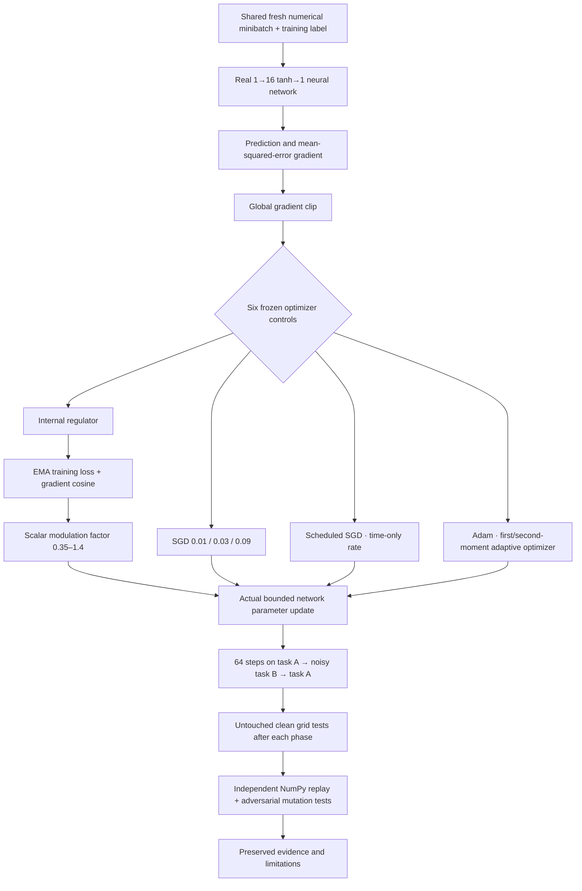
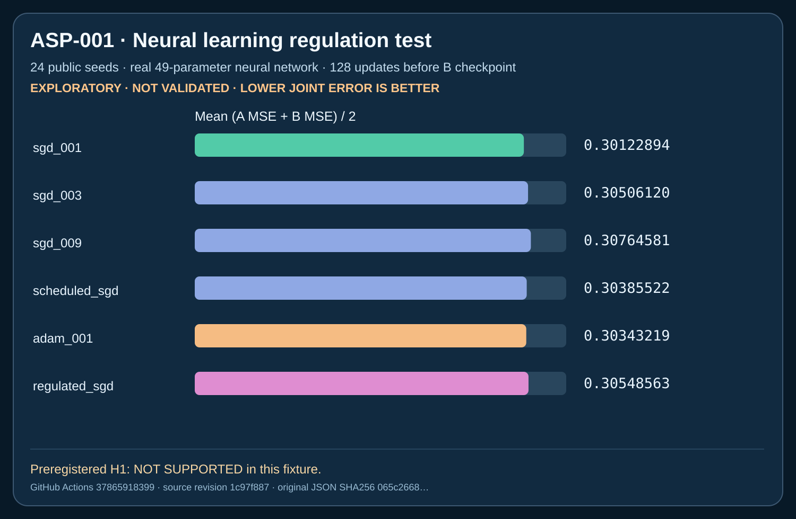

# ASP-001 — Artificial synaptic plasticity: real neural-learning experiment

**Research status:** `EXPLORATORY_NEURAL_PLASTICITY_NOT_VALIDATED` — preregistered hypothesis **NOT SUPPORTED** in the first 24-seed public test. This is a real small neural network, but the internal regulator is only a *mathematical learning-rate controller*, not human neurochemistry, genuine per-synapse biological plasticity, or a new form of life.

**[Full registered protocol](PROTOCOL.md) · [Complete numerical results](../../reports/asp001/ASP001_PUBLIC_EXPLORATORY.md) · [All original paired seed scores](../../reports/asp001/ASP001_PUBLIC_SEED_PAIRS.csv) · [GitHub Actions run](https://github.com/holland202/veritas-origin/actions/runs/37865918399)**

## The physical/technical question

What plays the role of a *learning regulator* inside an artificial neural network? We can implement a scalar variable derived from the model's own recent error and gradient changes and have that variable affect the actual weight update. That is a testable **functional analogue** of regulation, **not** a simulation of dopamine, glutamate, brain cells or cognition.



## Actual public result



After training on task B, the registered primary outcome was `(clean A_MSE + clean B_MSE)/2`:

- SGD lr 0.01: **0.301229** (best mean).
- Adam lr 0.01: **0.303432**.
- Scheduled SGD: **0.303855**.
- SGD lr 0.03: **0.305061**.
- **Regulated SGD: 0.305486**.
- SGD lr 0.09: **0.307646**.

The regulator varied on 191 of 192 update steps per seed, so it was actually functioning, but it failed the preregistered requirement to beat both SGD 0.03 and Adam, with paired majority wins against each. It beat SGD 0.09 on mean error, but selecting that weaker comparator after outcomes would be misleading.

## Reproduce locally on Android/Termux or Linux

This experiment has **no LLM inference, network requests, root permissions or cloud model credits**. It uses NumPy and the Python standard library. Use a Python environment with working NumPy 2.x.

```bash
git clone https://github.com/holland202/veritas-origin.git
cd veritas-origin
git switch experiment/asp001-internal-plasticity-regulation

python -c 'import numpy; print(numpy.__version__)'
python -m unittest discover -s tests -p 'test_asp001.py' -v

# Small preliminary test. This creates a NEW JSON; it never overwrites prior evidence:
python src/origin/asp001.py --pilot --smoke

# Full 24-seed public exploratory reproduction, ~small phone-friendly NumPy arrays:
python src/origin/asp001.py --pilot
```

Record the **exact EVIDENCE path and SHA256** printed by the last command, then replay that file (use the actual values, not placeholders):

```bash
python tools/verify_asp001.py EXACT_EVIDENCE_PATH --sha256 EXACT_HASH
python tools/plot_asp001.py EXACT_EVIDENCE_PATH --sha256 EXACT_HASH \
  --output-dir local-asp001-figures
```

The GitHub CI uses a pinned Python 3.12 / NumPy **2.2.6** environment. Termux may have a different NumPy build; the registered independent verifier allows tiny floating differences, but byte-identical evidence across environments is **not guaranteed**. Direct comparison requires version/environment notes.

## Original evidence and preservation

- Prospective protocol SHA-identified commit: `5e1f9918ddd7adbb2e890e418b25241ade96959e`.
- Full public raw JSON SHA256: `065c266864c1337e204488c1e01e71f69560c6db30cede6e10e98a908502e2a0`.
- [Raw full evidence + plotting SVGs + source manifest](https://github.com/holland202/veritas-origin/actions/runs/37865918399/artifacts/11588132315) — CI **30-day artifact**, expires **November 8, 2026 (UTC)**. Download/retain a byte-exact copy before expiration.
- Permanent public summaries: [full research report](../../reports/asp001/ASP001_PUBLIC_EXPLORATORY.md), [all-seed CSV](../../reports/asp001/ASP001_PUBLIC_SEED_PAIRS.csv), [SHA-identified result SVG](../../reports/asp001/figures/asp001_public_24seed_joint_mse.svg).
- Results pass **32 new ASP tests + 17 historical EXP003 tests**, independent numerical replay, original P0 SHA recheck. Tests are not external scientific confirmation.

## Where this fits inside VERITAS ORIGIN

See [Artificial Computational Biology research program](../../docs/ARTIFICIAL_COMPUTATIONAL_BIOLOGY.md) for the boundaries among network anatomy, geometry, learning dynamics, regulatory signals, evidence quality and action authorization.

QUASAR, EACE and Sovereign Veritas remain **independent cited research repositories**. ASP-001 code itself lives here in VERITAS ORIGIN; no other repository was overwritten, imported wholesale or modified.

**Next experimental idea, separately preregistered if pursued:** an actual synapse-specific plasticity/eligibility-trace mechanism, measured against strong established optimizer and continual-learning baselines using new held-out task families. Do not tune this ASP-001 result after observing its failure.
