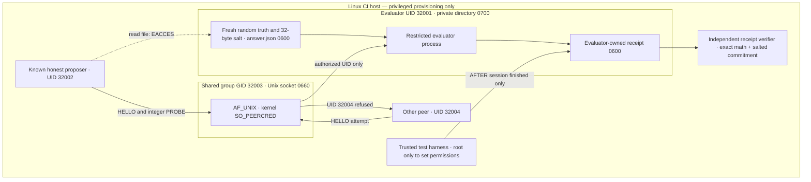

# C1-001 — Actual Linux UID-separated evaluator boundary

**Engineering scope: `PARTIAL_DAC_DEMONSTRATED_NOT_SANDBOXED`.**

This experiment goes one step beyond [EBA-001](../eba001/README.md): evaluator and proposer really execute as different non-root Unix users, and the hidden answer is generated **after** the Linux integration run begins. A trusted GitHub Actions controller exercises both denied and permitted operations.

It is **NOT** an OS sandbox for arbitrary model-generated code, a completed EXP003-C1 evaluation, a real AI test, or an autonomous research system.

[Prospectively registered protocol](PROTOCOL.md) · [Measured evidence and limitations](../../reports/c1001/C1001_RESULTS.md) · [GitHub Actions run 37861793489](https://github.com/holland202/veritas-origin/actions/runs/37861793489)

## Actual execution boundary



No network service is exposed by the evaluator: transport is a local AF_UNIX stream socket. **This alone is not a network-egress restriction on the proposer**. Scripts are staged into a separate world-readable temporary *program* directory on CI, because restricted Unix UIDs cannot traverse the GitHub checkout. Only the evaluator's **data** lives under the protected directory.

### Protocol and receipts

- The evaluator randomly selects four public named predicates and an unknown actual predicate; the hidden assignment is not derived from the public EXP003-P0 seed stream.
- The proposer receives only candidate names, predicate definitions, legal probe domain, observations, budget and a salted SHA-256 commitment. The truth and salt are absent from the response.
- A strict `HELLO` / `PROBE` JSON protocol admits unique integer 0–31 probes, with a six-probe ceiling. Other operations and extraneous fields fail.
- The evaluator checks the connecting process's **kernel-reported peer UID** and refuses a different UID, even when the process possesses the shared socket group.
- Only when the evaluator exits does the root test controller read its 0600 receipt (which then discloses salt, true predicate and full transcript). A separate mathematical verifier checks the disclosed precommitment and replay.
- `VERIFY PASS` is consistency with the disclosed mathematical trial and **does not attest access telemetry**. The root controller and evaluator remain within one privileged host trust boundary.

## What was actually tested

| Test | Enforcer | Observed in GitHub Actions |
|---|---|---|
| Proposer cannot open the evaluator's hidden answer file or its private directory | Linux DAC 0700/0600 | **EACCES** |
| Other UID in the *same socket group* cannot communicate as the proposer | Linux `SO_PEERCRED` | **DENIED** |
| Bad actions or extra `truth` / `approval` fields | Strict JSON command parser | **DENIED** |
| Duplicate legal probe | Evaluator state machine | **DENIED** |
| Honest context-only proposer, restricted UID, fresh task | Linux socket and mathematical evaluator | **COMPLETED** |
| Receipt probe data changed, hidden truth edited or SHA resealed | Independent mathematical verifier | **REJECTED** |
| Present self-reported client telemetry as security attestation | Evidence classifier | **NOT ACCEPTED** |
| Arbitrary code, network, root attack, side channels, memory/CPU exhaustion | Not implemented | **NOT TESTED** |

The real OS test is intentionally separate from pure unit tests. If `setpriv`, Linux `SO_PEERCRED`, root provisioning, file ownership or actual UID dropping is unavailable, it **FAILS**, rather than simulating success. The smoke uses only reviewed, known test programs; it is not suitable for testing hostile agent code.

## Reproduce without external APIs

For pure protocol and independent replay tests (stdlib Python):

```bash
python3 -m unittest discover -s tests -p 'test_c1001.py' -v
```

For the real **Linux** negative controls, use an isolated disposable test machine or GitHub Actions runner where you have permission to provision ephemeral Unix UIDs. This step requires root and must **not** run indiscriminately on your Android phone:

```bash
sudo -H python3 experiments/c1001/run_linux_smoke.py \
    --run-linux-dac --output-dir /tmp/c1001-public-evidence
```

The output files contain **post-session disclosed toy answers**, plus an OS-control summary, and are created exclusively without overwriting. Verify the original exact receipt using the reported SHA-256:

```bash
python3 tools/verify_c1001.py \
    /tmp/c1001-public-evidence/c1001-independent-replay-receipt.json \
    --sha256 THE_EXACT_RECORDED_SHA256
```

This should run on a disposable Linux environment, not on a device whose system user IDs, owner permissions or OS tools might conflict with this test. It creates and deletes *only* its temporary OS fixture; historical repo files are not changed.

## Complete records and limitations

- [Actual passing GitHub run 37861793489](https://github.com/holland202/veritas-origin/actions/runs/37861793489), **17 EXP003 + 28 RA-001 + 24 EBA-001 + 29 C1-001 = 98 passed**.
- Independently replayed post-session receipt SHA-256: `ea60a6cc2a83a7be47e5596e4f89e9ee5231518b06e1d700a28dc8f10bca9b2e`.
- Raw JSON receipt + OS-control result: [Actions artifact 11585724715](https://github.com/holland202/veritas-origin/actions/runs/37861793489/artifacts/11585724715), retained 30 days only. Never substitute this README for the original bytes.
- Development failures intentionally retained: [unit import docstring false positive](https://github.com/holland202/veritas-origin/actions/runs/37861652774), [GitHub checkout inaccessible after dropping UID](https://github.com/holland202/veritas-origin/actions/runs/37861692397), and [second client path still pointing to protected checkout](https://github.com/holland202/veritas-origin/actions/runs/37861755910).
- The separate [Sovereign Veritas publication-intent adapter](../../docs/SOVEREIGN_VERITAS_BOUNDARY.md) stays **unauthorized**. No permission to deploy or publish a stronger research claim is inferred from this demonstration.

**Remaining blockers:** protection of GitHub `main`, independent access telemetry immune to a compromised root/evaluator, network and process confinement, resource limits, withheld-task methodology with real model proposals, independent review, authenticated capability approval and a plan for long-term artifact retention.

**Do not label this result `SECURE_SANDBOX` or `EVALUATOR_ISOLATION_VALIDATED`.**
