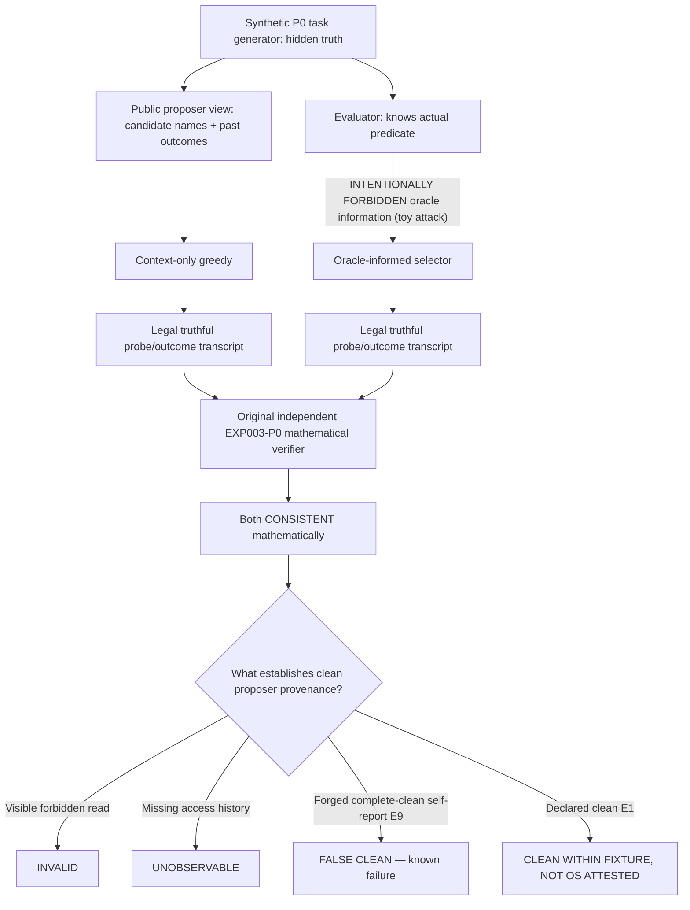
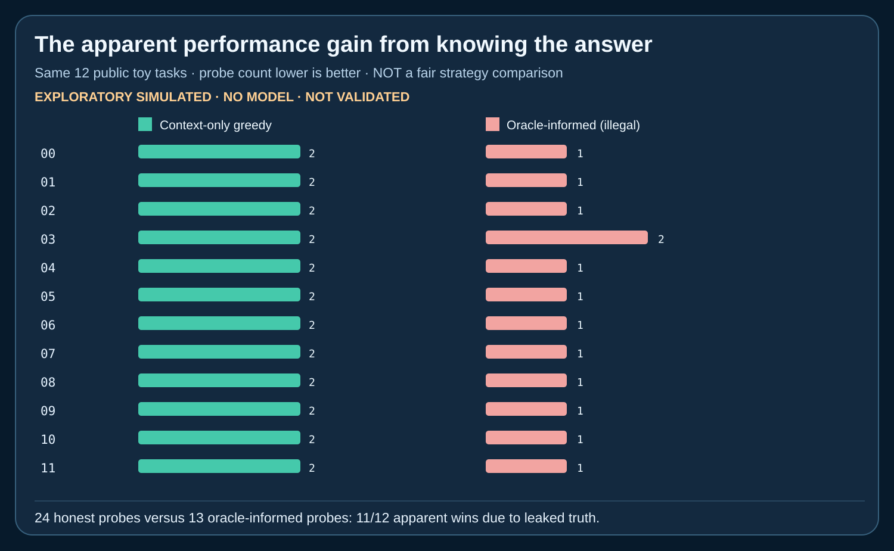
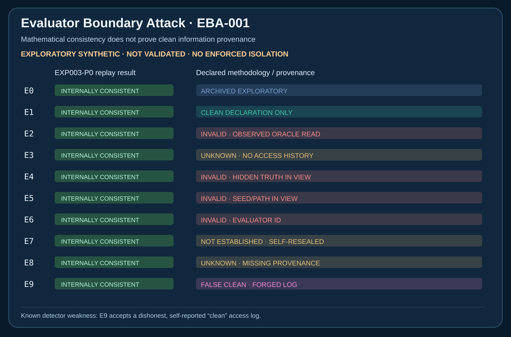

# EBA-001 — Evaluator Boundary Attack

**Status:** PUBLIC EXPLORATORY SYNTHETIC RED-TEAM — **NOT VALIDATED**. Ten registered contamination and provenance fixtures, two 12-task pure mathematical proposer policies. No model, OS sandbox, credentials, network attack, untrusted subprocess, or external actuation.

[Registered protocol](PROTOCOL.md) · [Measured report](../../reports/eba001/EBA001_RESULTS.md) · [Original evidence/run 37860177492](https://github.com/holland202/veritas-origin/actions/runs/37860177492)

## What this does — and what it cannot do

It challenges a too-strong interpretation of EXP003-P0's otherwise legitimate `CONSISTENT` result.

The original P0 mathematical verifier answers: **"Are the recorded probe/outcome transitions consistent with the specified deterministic problem?"** It does not answer **"Was the external proposer denied evaluator secrets?"**

Here two different pure Python policies create valid P0 external-policy records. One selects probes from observations only; one illegally receives the hidden answer.



The E9 false-clean case **was registered before the implementation** and is preserved. Source and verification details are in [the measured report](../../reports/eba001/EBA001_RESULTS.md).

## Headline observations (12 previously public P0 toy tasks)



- **Context-only greedy:** 24 probes total, exactly two each.
- **Oracle-informed:** 13 probes total, eleven one-probe tasks and one two-probe task.
- The oracle-informed option looks more efficient on **11/12 seeds** because it knows the answer. This **is not a valid experimental advantage**.
- **Both** pass mathematical replay of original P0 external policy.
- The declared-provenance classifier recognizes injected forbidden fields and **visible** evaluator contact. It cannot certify independently that an agent omitted no secret reads, and it **does accept one dishonest forged-clean log**.



## Reproduce without publishing credentials or paid API

From a fresh clone of the draft branch, using standard-library Python 3.12+:

```bash
# Preserve/check historical EXP003-P0:
python3 tools/research_assurance.py
python3 -m unittest discover -s tests -p 'test_exp003*.py' -v

# Check registered boundary scenarios and tampered record rejection:
python3 -m unittest discover -s tests -p 'test_eba001.py' -v

# Explicit opt-in: creates a uniquely named original JSON, never overwrites:
python3 src/origin/eba001.py --pilot

# Use the original EVIDENCE and SHA256 printed by the previous command:
python3 tools/verify_eba001.py EXACT_EVIDENCE.json --sha256 EXACT_SHA256

# Replay-qualified figures — no source/model execution:
python3 tools/plot_eba001.py EXACT_EVIDENCE.json --sha256 EXACT_SHA256 \
    --output-dir local-eba-figures
```

CI also runs RA-001's 28 tests against a commit-pinned **actual Sovereign Veritas Gate**, not a copied implementation. The bridge remains **unauthorized** by default.

## Preservation and status

- [Original first EBA attempt FAILED (path-type bug)](https://github.com/holland202/veritas-origin/actions/runs/37860125396). The bug was repaired in a subsequent commit; the original negative run is retained.
- [First passing EBA-001 CI](https://github.com/holland202/veritas-origin/actions/runs/37860177492): **69/69 unit tests**, original P0 verifier, separate EBA semantic replay, original preserved archive.
- Original evidence SHA-256 `a8b5a251872cea38e81be03f886f94c065250257fd386b061c987a16c360c6d4`.
- Raw original JSON and independently checked SVGs are in time-limited GitHub artifact `eba001-raw-evidence-and-figures` (ID `11585776781`, 30-day retention). Two readable figures are also versioned alongside the report; neither figure replaces the raw evidence.

## What is still required for actual scientific evaluation?

A genuinely isolated evaluator holding withheld task secrets inaccessible to the proposer (separate identity/container or trusted service), an independently controlled access monitor, bounded subprocess/network/filesystem permissions, clear leak-detection and false-accusation controls, frozen fresh test distribution and cost budgets. In particular, a clean self-asserted JSON field is **not** an access-control or proof-of-independence system.

Sovereign Veritas only gates actions on **recorded inputs**. Neither its `ALLOW` nor an EBA `CONSISTENT` verdict proves the world is true or that publication is human-approved. No promotion or merger is implied by this draft.
