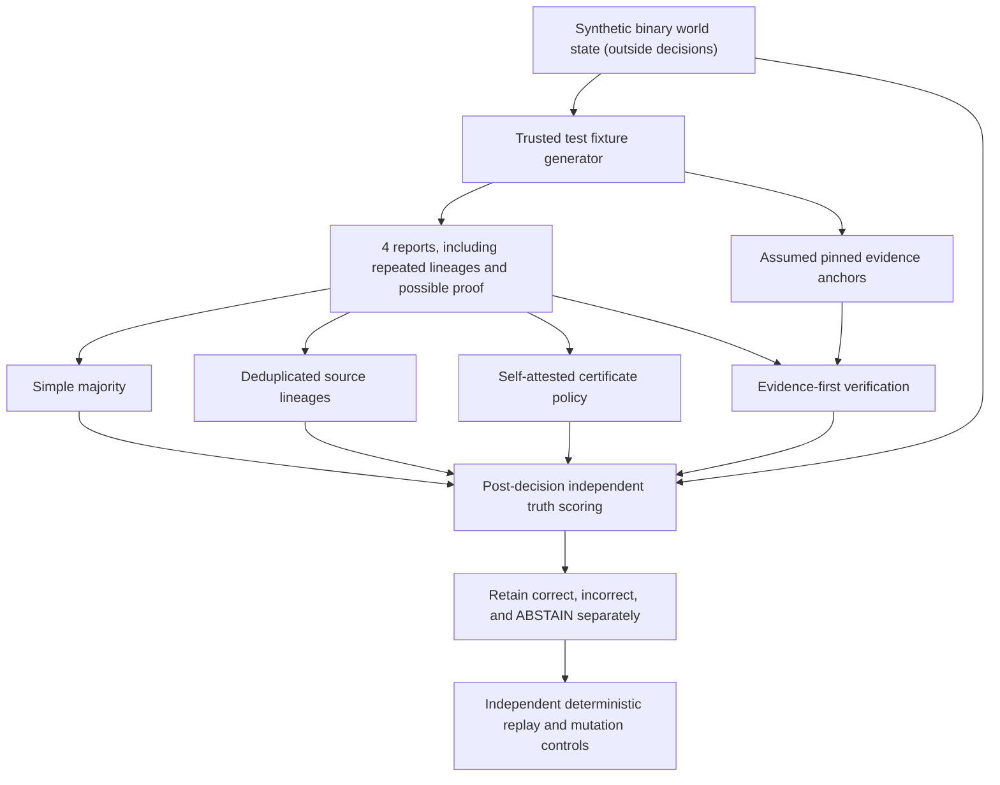

# EPV-001 — When should an agent believe a majority?

**Exploratory deterministic study; not validated; NO language model used.**

[Preregistered protocol](PROTOCOL.md) · [Original results and known false positive](../../reports/epv001/EPV001_RESULTS.md) · [Frontier Red Team research map](../../docs/FRONTIER_RED_TEAM_RESEARCH_EXTRAPOLATION.md) · [Passing GitHub run](https://github.com/holland202/veritas-origin/actions/runs/37871992687)

## Core question

In multiagent interactions, three agents can all repeat **one mistaken source**, while a lone agent may have an independently verifiable piece of evidence. How do we distinguish one source replicated three times from three independent sources? Can a system preserve decisive dissent and abstain when the evidence is missing?

These are **mechanisms of evidence interaction**, not artificial consciousness or a demonstration of human thought.



**Anchor authenticity is assumed by the fixture, not proved.** A valid SHA-256 proof can still bind a false statement if the authority supplying the reference is poisoned. This is deliberately included as a negative case.

## Measured cases

Each situation has **512 deterministic trials** across eight seeds. Total **3,072 four-scout episodes**.

| Situation | Majority wrong | Evidence-first wrong | Evidence-first defers |
|---|---:|---:|---:|
| Three independent honest, one liar | 0 | 0 | 0 |
| Three copies of false report, independently verified dissenter | **512** | 0 | 0 |
| Three copies of false report, unverified dissenter | **512** | 0 | **512** |
| Forged dissenting proof | 0 | 0 | 0 |
| **Corrupt trusted anchor (known detector failure)** | 0 | **512** | 0 |
| Conflicting anchors | 0 | 0 | **512** |

The two crucial constraints are that an abstention is **not** equivalent to a correct answer, and an internally valid commitment is **not** sufficient for real-world truth.

## Reproduce from Termux or Linux

Uses **Python standard library only** (no network, no API credits, no NumPy, no root):

```bash
git clone https://github.com/holland202/veritas-origin.git
cd veritas-origin
git switch experiment/epv001-multiagent-evidence-vigilance

python -m unittest discover -s tests -p 'test_epv001.py' -v

# Explicit opt-in. Creates new, uniquely named evidence file.
python src/origin/epv001.py --pilot
```

Record the exact `EVIDENCE` and `SHA256` values printed by the runner:

```bash
python tools/verify_epv001.py EXACT_EVIDENCE_PATH --sha256 EXACT_SHA256
```

The verifier independently reconstructs all 3,072 trials and their policies without importing the producer. Its verdict means **specification consistency only**, not genuine multiagent intelligence, OS-authenticated evidence, or an independent world oracle.

## Original evidence and negative cases

- Preregistered protocol commit `f5c37769745900ec5a494d1abec58dbadac257dd`.
- [GitHub Actions 37871992687](https://github.com/holland202/veritas-origin/actions/runs/37871992687), **27/27 EPV tests + 17/17 historical tests passed**.
- Original full JSON SHA-256 `5867b9ea49b97065dafd96d190daba53cb2417e4a13ff6c4e1f9a99521d10368`.
- [Original JSON and source-linked summary artifact 11590892458](https://github.com/holland202/veritas-origin/actions/runs/37871992687/artifacts/11590892458), 30-day retention until **Nov 8, 2026 at 01:54 UTC**; preserve the exact bytes before expiry.
- No original EXP003-P0, ASP-001, ITC-001, Sovereign Veritas or related repository evidence was modified.

**This is an instrument for future falsification, not a model capable of independent judgment.** Before involving actual LLM agents, the next benchmark must protect reference provenance and score abstention, latency, and false authority separately.
