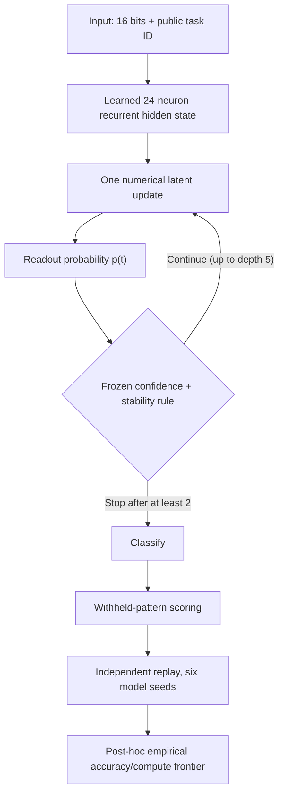

# ITC-001 — Internal recurrent computation, not human thoughts

**Result:** fixed recurrent depth improved over a single pass, but registered adaptive-selection benefit **NOT SUPPORTED**. A later, explicitly **POST-HOC** audit found that a real masked early-exit implementation used 40.4% fewer hidden state updates but **more wall-clock time** on the measured GitHub runner.

[Prospective protocol](PROTOCOL.md) · [Complete experiment report](../../reports/itc001/ITC001_PUBLIC_EXPLORATORY.md) · [6-seed paired metrics](../../reports/itc001/ITC001_PUBLIC_SEED_METRICS.csv) · [Compute frontier visualization](../../reports/itc001/figures/itc001_empirical_accuracy_compute.svg) · [Passing GitHub run](https://github.com/holland202/veritas-origin/actions/runs/37868100328)

## The measurable notion of internal computation

A recurrent neural network can transform hidden numerical states multiple times **before** producing its final decision. ITC-001 measures whether those additional transformations help on six small binary tasks and whether a mathematical confidence/stability rule allocates an inference budget better than a **within-task matched random allocation**. It does not test subjective thoughts, consciousness, human neurochemistry, biological neurons, symbolic chain-of-thought, or human-equivalent reasoning.



The neural network uses **1,153 learned parameters**, 640 training updates per seed, and six seeds. Inputs in training and evaluation have no exact 16-bit pattern overlap. Deep supervision also trains its shallow outputs, so more recurrent passes are **not automatically better**. The adaptive gate is **hand-set**, not a learned ACT algorithm.

## Registered results

| Readout | Mean accuracy | Mean hidden steps |
|---|---:|---:|
| Fixed 1 | 87.90% | 1 |
| Fixed 2 | 90.84% | 2 |
| **Fixed 3** | **91.26%** | **3** |
| Fixed 5 | 91.17% | 5 |
| Adaptive | 91.24% | 2.98 |
| Within-task randomized allocation | 91.21% | 2.98 |

**H1:** fixed five vs one exceeded the registered +2 percentage-point benchmark; exploratory threshold met, not independently validated. **H2:** adaptive vs matched random allocation gained only +0.0285 percentage points with 2/6 paired wins; **NOT SUPPORTED**. The difficult 8-bit parity task remained near chance.

## Statistical–computational tradeoffs (new post-hoc analysis)

An empirical Pareto frontier compares **measured performance** with **a resource proxy**. It does not establish a formal information-theoretic threshold, computational threshold, or gap. In fact, exact bit-parity is cheaply computable with XOR; this task's learned-network parity failure cannot justify a complexity-hardness claim.

The frozen original study computed all five passes, even for would-be early-stopped examples. A separate [real masked-runtime audit](../../tools/measure_itc001_compute.py) now actually stops selected rows and proves its predictions and stop depths match the original evidence. It saves hidden steps but was slower in NumPy on one runner because reduced arithmetic was outweighed by overhead. See [the main report](../../reports/itc001/ITC001_PUBLIC_EXPLORATORY.md) for timings and provenance.

## Local reproduction: Python + NumPy, including Termux

```bash
git clone https://github.com/holland202/veritas-origin.git
cd veritas-origin
git switch experiment/itc001-recurrent-internal-deliberation

# The GitHub CI version is pinned to NumPy 2.2.6.
python -c 'import numpy; print(numpy.__version__)'
python -m unittest discover -s tests -p 'test_itc001*.py' -v

# Explicit opt-in only; writes uniquely named evidence, no replacement:
python src/origin/itc001.py --pilot
```

Copy the exact `EVIDENCE` and `SHA256` values printed by the command. Replace placeholders below with those exact values:

```bash
python tools/verify_itc001.py ORIGINAL_EVIDENCE.json --sha256 ORIGINAL_SHA256

# This analysis is clearly POST-HOC.
python tools/analyze_itc001_tradeoffs.py ORIGINAL_EVIDENCE.json \
  --sha256 ORIGINAL_SHA256 --output-dir local-itc-tradeoff

# Actual masked early-exit compute, not simulated step count:
OPENBLAS_NUM_THREADS=1 python tools/measure_itc001_compute.py \
  ORIGINAL_EVIDENCE.json --sha256 ORIGINAL_SHA256 \
  --repetitions 7 --output-dir local-itc-runtime
```

No external model API, root privileges, cloud account, or network calls are needed for the Python experiment. Your phone may run a different NumPy version or BLAS implementation: compare results carefully and **never claim byte-equivalent evidence across environments without checking**.

## Full original evidence

The **exact original 4,060,668-byte JSON is now stored permanently in this draft branch**, not merely in a 30-day workflow attachment:

**[Open the original ITC-001 full numerical evidence](../../evidence/itc001/ITC001_PUBLIC_6SEED.json)**

Git blob SHA-1: `d818bd27e509b3b578496dd028c949b619466e77`. [Archival run 37868677991](https://github.com/holland202/veritas-origin/actions/runs/37868677991) retrieved the **exact first-run bytes**, verified the original SHA256, performed independent replay, and committed them without modifying an existing file. Two unsuccessful archival attempts were retained; the write-permission workflow was disabled after the successful commit. Read [the archival correction record](../../reports/itc001/ITC001_PUBLIC_EXPLORATORY.md#long-term-original-evidence-preservation--completed-after-the-first-run).

[GitHub Actions artifact — complete JSON and audits](https://github.com/holland202/veritas-origin/actions/runs/37868100328/artifacts/11588844275), 30-day retention, expires approximately **2026-11-08 01:06 UTC**.

Original full evidence SHA256:
`701703011d39482020bbfd9c40c203fc23fcd64859887cb9edcf15ea93d7ff68`

The original registered research protocol, learning code, independent verifier, negative tests, results report, seed-level CSV, source digest manifest (in artifact) and post-hoc compute study are preserved as separate records. No original ASP-001 result, Sovereign Veritas kernel or historical P0 evidence was modified.

The GitHub branch and accompanying PR remain **draft**, and there is **no automatic publication/deployment authorization**.
