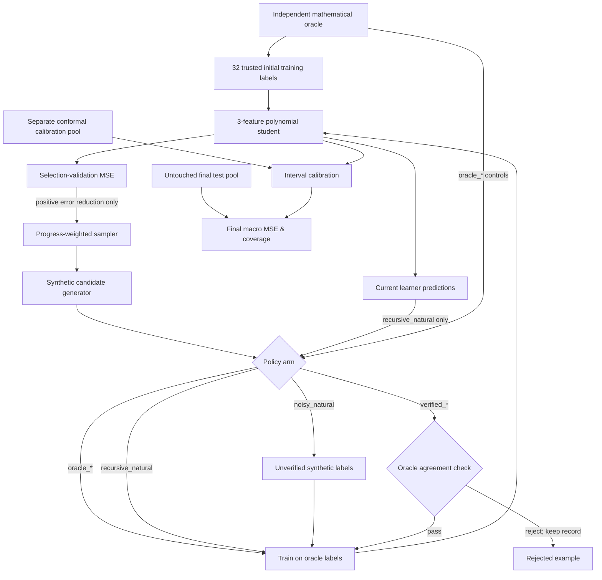
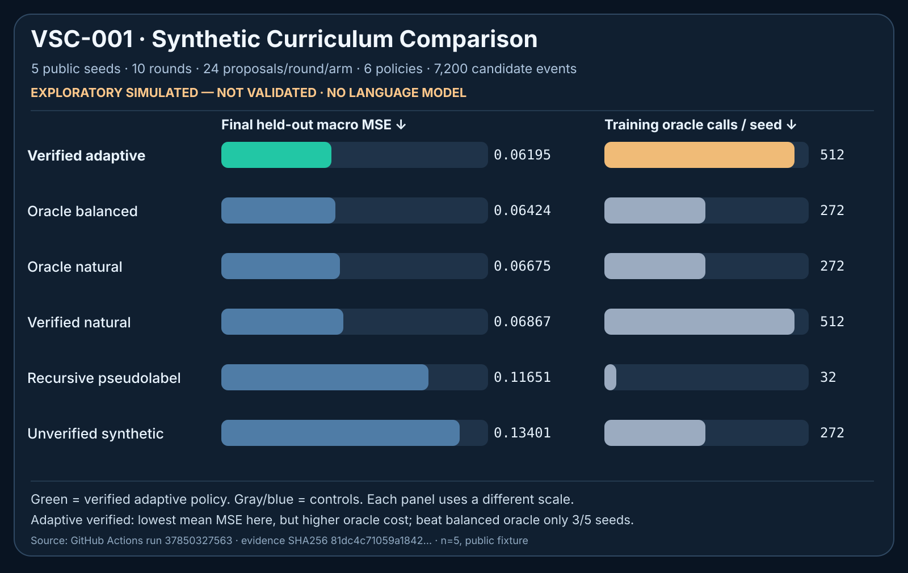

# VSC-001 — Verifiable Synthetic Curriculum

**EARLY EXPLORATORY SIMULATION / NOT VALIDATED.** This is a *toy mathematical training experiment*, not a large language model, not a replacement for human text, and not evidence that model collapse has been solved.

## What is actually implemented

A standard-library-only pipeline generates numerical examples from four known mathematical response families; a separate code path checks synthetic labels against the exact mathematical oracle; a small polynomial learner trains under six policies. Positive improvement on a **curriculum-selection** validation split influences only the `verified_progress` sampler. A separate conformal-calibration split and the final test split never choose training examples.

All policies start from the same 32 truthful labels; each receives the same number of candidate proposals and the same fixed held-out evaluation sets. They **do not** use equal amounts of trusted information.

The six policies are `oracle_natural`, `oracle_balanced`, `noisy_natural`, `verified_natural`, `verified_progress`, and `recursive_natural`.

- **Oracle controls:** direct simulator truth on natural and balanced sampling distributions.
- **Noisy control:** simulator-generated proposed labels with deterministic injected corruption; unverified.
- **Verified controls:** synthetic proposed labels independently checked against exact simulator oracle; mismatches are rejected without replacement. One natural, one progress-driven.
- **Recursive control:** self-generated pseudolabels from the current learner plus noise. No trusted new labels.

The verified policies use **two simulator oracle calls per candidate**, whereas direct oracle and noisy policies use one, and recursive uses none beyond the original labeled examples. The `train_oracle_calls` measure counts initial labels plus candidate oracle access; `total_allocated_oracle_calls` adds shared validation, conformal and held-out labeling as an *allocated accounting comparison*. Those fixed evaluation labels are generated once per seed and are shared by all policies, not called afresh for every model scoring pass. The `selection_score_comparisons` field counts repeated model evaluations, **not oracle calls**.

## Visual architecture — data generation, selection and verification

This Mermaid diagram renders directly in GitHub. **All training is toy numerical simulation**, and the model's scores on the final held-out test set do not influence which training examples it receives.



The oracle is *not physically isolated*: exact mathematical truth is defined in the same execution environment, and checking it consumes extra privileged oracle calls. This is only a strict simulator study, **not evidence that an independent model could not read hidden truth**.

### Results at a glance



**Figure scope:** public-fixture, five synthetic seeds. Lower MSE is better; lower oracle cost is cheaper. Error and training-oracle calls use separate labeled scales so the visual doesn't conflate them. This is not confirmatory.

## Reproduce without Azure

From repository root (Python standard library; no NumPy or external services):

```bash
python3 -m unittest discover -s tests -p 'test_vsc001.py' -v
```

Run deliberately **public** engineering fixture (not a benchmark):

```bash
python3 src/origin/vsc001.py --pilot --seeds 2 --rounds 5 \
  --candidates-per-round 12 --test-seed-base 707 \
  --allow-public-test-seed
```

For a separate **exploratory** run with a newly randomized, later-disclosed seed:

```bash
python3 src/origin/vsc001.py --pilot --seeds 5
```

This saves an entirely new JSON file by exclusive create under `evidence/vsc001/` (never overwritten) and prints its own digest. Use the exact printed values:

```bash
python3 tools/verify_vsc001.py ACTUAL_EVIDENCE_PATH --sha256 ACTUAL_SHA256
```

The standalone verifier imports **no experiment runner**; it reimplements the generator, learner, training and sampling, verifies every candidate event and aggregate, and rejects rehashed semantic tampering. Internal agreement is **not** proof that simulation matches the world, that withheld data were inaccessible to a malicious model, or that the simulator is scientifically adequate.

## Evidence classification

- `PUBLIC_TEST_SEED`: deliberately published reproducible fixture, not unseen evaluation.
- `REVEALED_AFTER_RUN`: randomly chosen seed published with archived artifact, hence not reusable as unseen holdout.
- `EXPLORATORY_SIMULATED_NOT_VALIDATED`: only a bounded numerical test.
- `CONSISTENT WITH VSC-001 SPECIFICATION`: code-level replay, **not external truth**.

Do not treat a model's higher apparent accuracy as a new result without paired controls, cost normalization, and strong confidence intervals. Coverage is *empirical split-conformal coverage in this simulated setting*; finite-sample conformal assumptions fail under distribution shift.

## Previous research / prior art / rights

This prototype is inspired by [QUASAR's progress-driven curriculum](https://github.com/holland202/quasar/tree/ba050b640b791d79d4cfcf5266f01cfd406124a7) and acknowledges its preserved refutation of error-priority sampling (F16). QUASAR root LICENSE: MIT. No implementation code copied.

[Coverage-Preserving Synthesis](https://github.com/holland202/coverage-preserving-synthesis/tree/a90f8dbd4e4ac736226ceb04119a996fd641d46d) motivated including a separate conformal check. Its root LICENSE says **all rights reserved**. No implementation code copied.

Existing prior art includes supervised simulation, self-training, active curriculum learning, data validation, and split conformal prediction. The novelty of their combination is **NOT ESTABLISHED**; a source/literature/patent review would be needed for any novelty or commercial reuse claim. This project uses AI-assisted code development.

## Critical gaps before expanding to the actual data wall

1. Independently controlled evaluator outside model process/UID, secret oracle isolation and genuine research-world ground truth.
2. Distribution-shift test, non-Gaussian/error-dependent corruption, rare-case retention and realistic simulator failure.
3. Strong matched-oracle-budget controls (including verification at the same oracle cost as direct simulation), cost-per-correct result and risk of false rejection.
4. Model architecture, real training loss and compute budget checks, real corpus mixture and recursive generation, continuous generations, model-weight provenance and held-out reproducibility.
5. Preregistered confirmation with frozen sample size, endpoints and statistical comparisons. Negative results must be retained.
6. Compare to existing data-curation and verification-aware curricula, not just the deliberately weak naive recursive control.

**No cloud, system services, original evidence archives, or unrelated repositories are modified by this module.**
