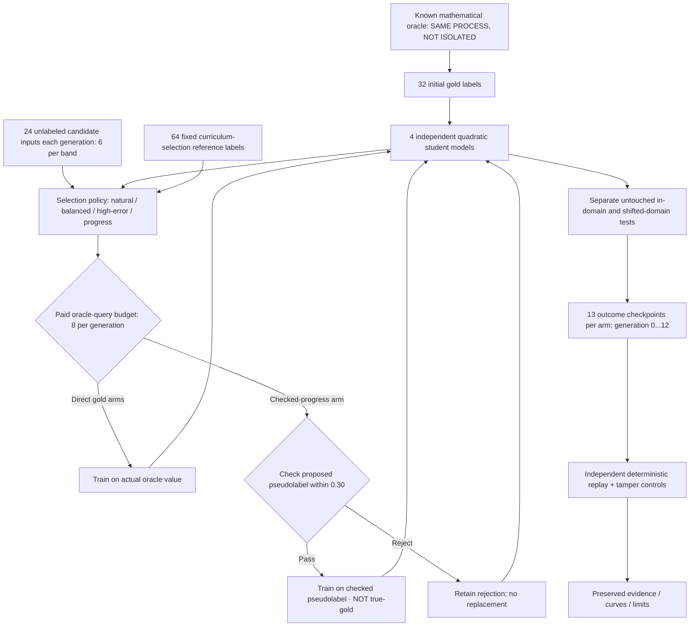
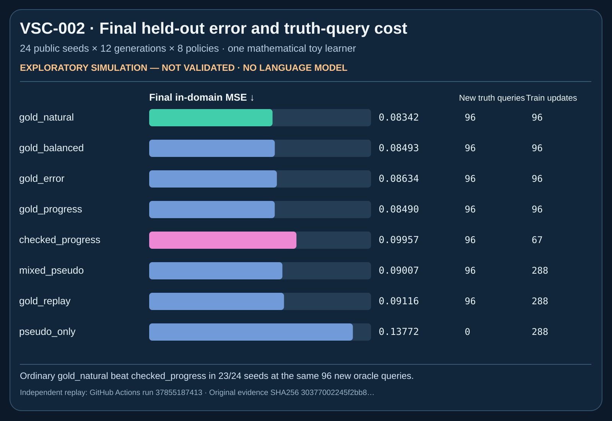
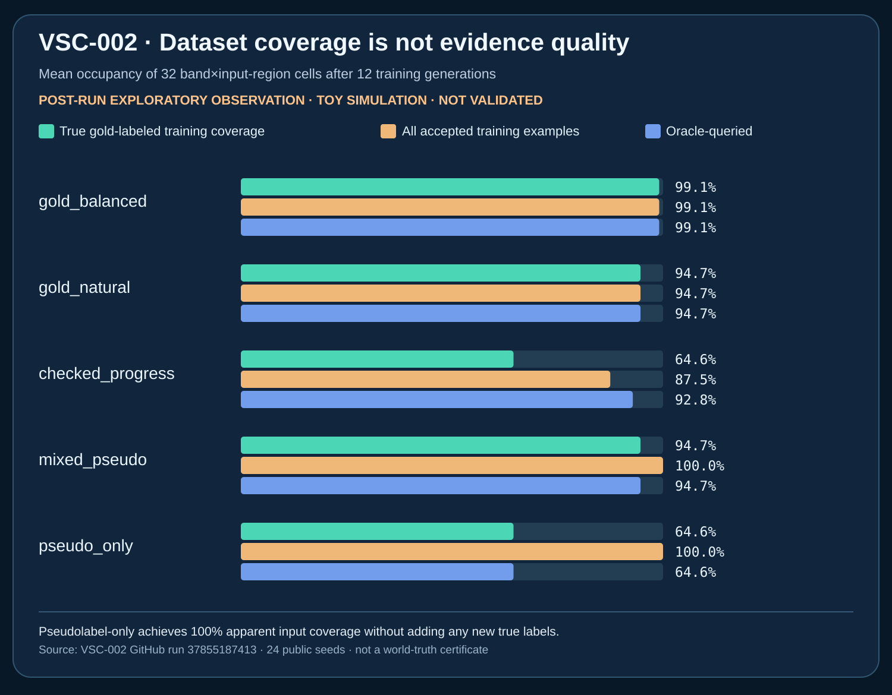

# VSC-002 — Longitudinal verifiable synthetic curriculum

**Status: EXPLORATORY PUBLIC SIMULATION / NOT VALIDATED.** This is a numerical teacher/student toy experiment, not a language model, a human-text pretraining substitute, or a demonstrated cure for recursive model collapse.

This is a **separate** VSC-002 study built on top of VSC-001. It does **not change VSC-001's code or evidence**. Our VSC-001 result suggested that verifying a generated label could help relative to blindly accepting corruption, but consumed more truth-label calls. VSC-002 fixes the cost comparison by forcing **eight new oracle-query opportunities per generation** for all seven oracle-assisted policies.

## Architecture and trust boundaries



The recursive-only arm does not request new oracle labels; the gold-replay and mixed-pseudo arms use additional training updates at the same *new-label* budget as the direct gold controls. Final held-out labels cannot select curriculum weights. The mathematical oracle shares a process with the learner: this is **not secure oracle isolation**.

## Reproduction (Python standard library only)

```bash
# Run VSC-002 adversarial suite and verify original VSC-001 did not regress.
python3 -m unittest discover -s tests -p 'test_vsc001.py' -v
python3 -m unittest discover -s tests -p 'test_vsc002.py' -v

# Public deterministic, 24-seed exploratory protocol (not confirmatory).
python3 src/origin/vsc002.py --pilot --seed-base 20261009 \
    --seeds 24 --generations 12

# Pass the EXACT path and SHA256 printed by the previous command:
python3 tools/verify_vsc002.py EXACT_EVIDENCE.json --sha256 EXACT_SHA256

# Generate six labeled SVGs ONLY after independent evidence replay:
python3 tools/plot_vsc002.py EXACT_EVIDENCE.json --sha256 EXACT_SHA256 \
    --output-dir local-figures
```

Writing an evidence JSON uses exclusive creation, so prior evidence is not overwritten. The generator uses public seeds and code; repeated runs reproduce the same substantive outcomes, but file timestamps and names differ.

## First 24-seed exploratory result

<box>

- [Full numeric report and negative findings](../../reports/vsc002/VSC002_LONGITUDINAL_EXPLORATORY.md)
- [Original CI run and six trajectory figures](https://github.com/holland202/veritas-origin/actions/runs/37855187413)
- Raw evidence SHA256: `30377002245f2bb8df6454ecbc4f36ddb0e3114f7c7d9f682d8e658ef568f90c`
- CI artifact: `vsc002-public-seed-evidence-and-figures` (ID `11583064547`, expires 2026-11-07; archive separately before then)

</box>

The direct `gold_natural` arm achieved mean final in-domain MSE **0.083416**. The proposed `checked_progress` arm achieved **0.099573** despite both receiving 96 new truth-label queries per seed, and lost to `gold_natural` on **23 of 24 seeds**. It rejected ≈28.6 pseudolabels and trained on ≈67.4 of its 96 oracle-queried examples. The oracle source truth would have been a better training signal in this experiment. This is a **negative result** for the proposed method as tested.





The second figure shows that `pseudo_only` reached 100% *accepted training-input cell coverage* without expanding its **64.6% initial true-gold training-label coverage**. A checked pseudolabel remains a pseudolabel, not an independently measured gold label.

**Longitudinal and rare-case charts** are available in the raw CI artifact and can be independently regenerated with the command above; they are **not represented as confirmatory evidence**.

## What next

Before VSC-003, preregister why *checking* a proposed label should ever be more informative or cheaper than directly using a paid oracle label. Candidate ways to create that asymmetry include a genuinely cheaper binary checker, expensive reference labeling, restricted side-channel truth, or strategically limited verification; all require clear accounting and strong active-learning controls. Also explore rare-case starvation and shifted-domain errors with separate, untouched seeds and stronger student baselines.

This is an example of applying QUASAR's emphasis on **measured progress**, Evidence Ledger's distinction between **measured and inferred states**, and EACE's demand for **negative controls**, without copying their implementations. The methods have substantial prior art; scientific novelty and real-world transfer **NOT ESTABLISHED**.

**No human-text corpora, language-model training, cloud credits, unsafe subprocess agents, production actuators, or historical repository files were modified.**
