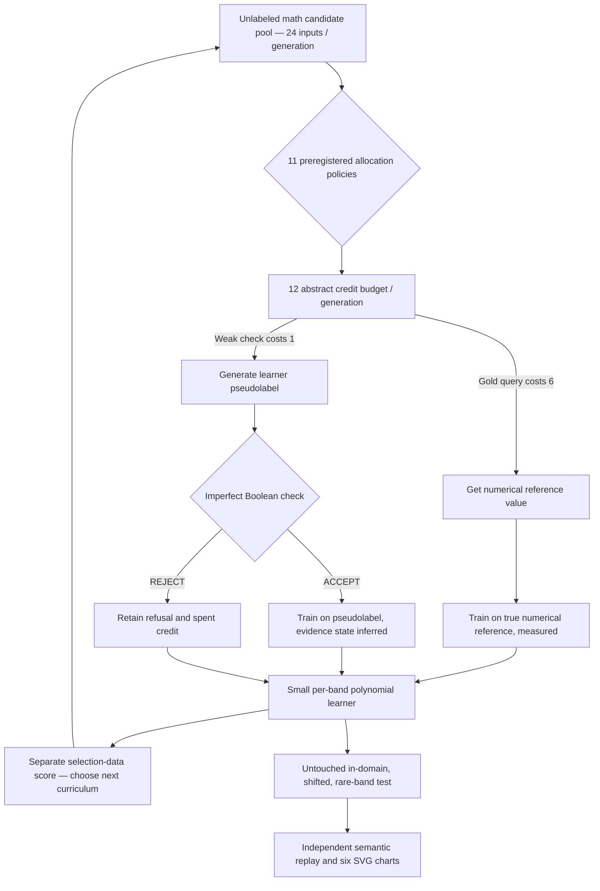

# VSC-003 — Cheap binary verification versus expensive truth labels

**Status:** PUBLIC EXPLORATORY SIMULATED — NOT VALIDATED. No language model, human text, Azure expense, hardware energy measurement, or real-world oracle. The pricing ratio (1 unit for a Boolean check vs 6 for an exact label) is a predeclared **mathematical assumption**, not measured API pricing.

This experiment continues [VSC-001](../vsc001/README.md) and [VSC-002](../vsc002/README.md) without editing their original results.

## What is new to this experiment?

VSC-002 showed that querying exact truth to verify a proposed label and then declining to use that numeric truth is not competitive with training directly on the already purchased gold label. VSC-003 explicitly **changes the information channel**: a cheap checker only gives a noisy ACCEPT/REJECT bit, while expensive oracle calls provide a numerical label.

The mechanism is not new by itself. Active learning with weak/strong labelers, verification, curriculum scheduling, and recursive synthetic training all have prior art. Our *bounded question* is whether their combination yields measurable utility **without promoting accepted pseudolabels into measured truth**.

## Workflow and truth boundary



**Limit:** the same Python process hosts the ground-truth generator, the checker and the learner, and raw post-run receipts include audit truth. The Boolean API is only a **program-interface boundary**, not OS/privilege containment. The fixed 32+64+192+192 initial/selection/test labels are separately shared reference information, not free external truth.

## Running independently (stdlib only)

```bash
# Existing VSC suites remain unchanged:
python3 -m unittest discover -s tests -p 'test_vsc001.py' -v
python3 -m unittest discover -s tests -p 'test_vsc002.py' -v

# VSC-003 37 behavior and rehashed forgery checks:
python3 -m unittest discover -s tests -p 'test_vsc003.py' -v

# Public, deliberately non-confirmatory 24-seed experiment:
python3 src/origin/vsc003.py --pilot --seed-base 20261033 --seeds 24 --generations 10

# Use EXACT values printed by runner:
python3 tools/verify_vsc003.py EXACT_EVIDENCE.json --sha256 EXACT_SHA256
python3 tools/plot_vsc003.py EXACT_EVIDENCE.json --sha256 EXACT_SHA256 \
    --output-dir temporary-figures
```

JSON evidence uses **exclusive file creation**. Only opt-in `--pilot` runs experiments. Independent verifier imports no runner code; a matching replay is *internal consistency*, not proof of external truth, software security, or novelty.

## Results: strong controls still matter

[Full preregistered public 24-seed result and integrity receipt](../../reports/vsc003/VSC003_PUBLIC_EXPLORATORY.md).


- Best **mean in-domain MSE** here: `gold_progress` **0.089287**, not the cheap-check arm.
- `checked_progress`: **0.094140** at the same 120 acquisition credits; beat natural gold in **7/24 seeds**.
- `hybrid_progress`: **0.090559**, slightly better mean than natural gold (0.090988) but only **12/24 seeds**, and worse than gold-progress. **Insufficient for superiority claim.**
- `gold_error` produced best mean rare-band MSE: **0.263169**; it can trade total accuracy against rare-case quality.
- `gold_plus_pseudo` was substantially worse at **0.133634** despite more student updates, while `pseudo_only` was **0.149165** with no new acquisition credits. Neither constitutes a real-world model-collapse finding.
- Imperfect Boolean checker truly failed in both directions. Across all 24 seeds and checking arms, independent replay found **399 false accepts and 413 false rejects**, with both correct and incorrect ground-truth proposals present (`ANTI_VACUITY: INFORMATIVE`).

**Negative result retained:** merely making verification cheaper does not establish improved learning or evidence quality, even when weak checks offer 6× more interactions per nominal credit than strong truth-label requests. Weak feedback has less information per decision and can admit contaminated labels.

## Exact evidence and visuals

- [CI run 37856725904](https://github.com/holland202/veritas-origin/actions/runs/37856725904): **108 tests passed**, independent replay, historical EXP003-P0 untouched.
- **Original raw evidence SHA256** `575efde7b949dd57faeeb0377ee837c452a9f466e4f29663f7e86ff1b6c3acc3`.
- Full GitHub Actions artifact `vsc003-public-evidence-and-six-figures`, ID `11584472029`, created October 8, 2026, **30-day retention**; archive elsewhere before expiration to preserve exact original bytes.
- Six generated charts: `vsc003_in_domain.svg`, `vsc003_shifted.svg`, `vsc003_rare.svg`, `vsc003_gold_coverage.svg`, `vsc003_accepted_coverage.svg`, and `vsc003_budget_and_weak_errors.svg`.
- Two concise SVG summary plots committed above for long-term report readability; they are **not substitutes for the full original evidence**.

## Existing research sources

See [the cross-source investigation note](CROSS_SOURCE_REVIEW.md) for **read-only Hugging Face** discoveries and **unverified Codeberg** repo/commit names.

Hugging Face `holland202/sovereign-evidence-bench` is a candidate for a future *model evaluation*, not for quietly retraining on its answers. `holland202/lde-cross-substrate-research` is a possible experiment provenance/reference source pending full file review. Codeberg `badatchess/local-discovery-engine` and `badatchess/sv-lab-vk2` are recorded as user-reported but unavailable to our present tools. **No code was copied or pushed to those services in VSC-003.**

### Next scientific question

Can a weak checker have positive **net information value per unit of cost**, or do direct labels, mixed feedback, or smarter acquisition schedules dominate? A separate VSC-004 could preregister a phase diagram over strong/weak cost ratio, verifier error, proposal quality, and task distribution with external benchmark separation. Do not retune this experiment after observing its outcomes.

GitHub PR stays **draft**, and no original evidence, existing Codeberg repository or unrelated project is overwritten.
