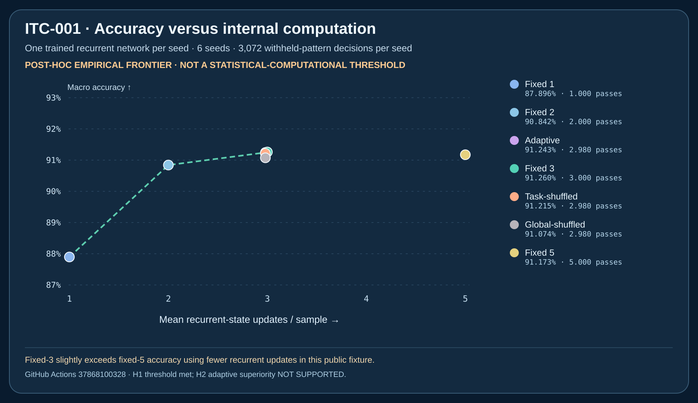

# ITC-001 — Iterated neural computation is useful; the proposed adaptive stopping policy is not established

**STATUS: PUBLIC EXPLORATORY NEURAL EXPERIMENT — NOT VALIDATED.**

The working phrase **"AI thoughts" is not used as a scientific output label**. This study measures repeated internal mathematical state transformations, not human thought, experience, consciousness, intention, self-awareness, or a biological nervous system.

## Prospectively registered research and experimental provenance

- Research program: [internal computation research map](../../docs/INTERNAL_COMPUTATION_RESEARCH_MAP.md).
- [Preregistered ITC-001 protocol](../../experiments/itc001/PROTOCOL.md), committed `d5a08e15fb9ca484fe10196614103a28dc895892` **before any ITC-001 model training or code execution**.
- Base: ASP-001 draft commit `905021915ae1cb32027f8ffcac60d2efb675f055`. No historical ASP-001, EXP003-P0 or Sovereign Veritas files were changed.
- [Passing first full ITC-001 CI run 37868100328](https://github.com/holland202/veritas-origin/actions/runs/37868100328) on source revision `98c450b72e63f... ` (GitHub Actions run shows the complete revision). Python 3.12, pinned NumPy **2.2.6**, single-thread BLAS configuration for runtime observations.
- 34 ITC tests passed (28 recurrent training/replay + six post-hoc masked-execution tests). Existing EXP003-P0 17 tests passed and original P0 byte digest and standalone verifier still passed. **51 total unit tests**, plus independent full numerical replay.
- Original full exploratory JSON **SHA-256**: `701703011d39482020bbfd9c40c203fc23fcd64859887cb9edcf15ea93d7ff68`.
- [Original raw JSON, manifest, post-hoc compute audit and SVG artifact](https://github.com/holland202/veritas-origin/actions/runs/37868100328/artifacts/11588844275); artifact ID `11588844275`, 30-day retention until **2026-11-08 01:06 UTC**. Archive the original bytes before expiry.
- Source-and-evidence manifest SHA-256 `0e1b6d142b62bd22d00c57c2bc2c0f2a0d655b609888cb35c992d51ffa683833`.
- [All six seed-level metrics permanently tracked](ITC001_PUBLIC_SEED_METRICS.csv), rounded for readability; original JSON is authoritative for full precision.
- [Permanent post-hoc tradeoff chart](figures/itc001_empirical_accuracy_compute.svg). Independent post-hoc SVG generated in CI SHA-256 `e853a217efe2957db83160868928a9dc615f747fe904e213884bab0058cb0247`.

## What was actually implemented

One **trained 1,153-parameter recurrent neural network**, sharing exactly the same learned weights for all inference policies:

`22 input features → 24 tanh recurrent hidden units → 1 binary prediction`

Inputs comprise sixteen visible bits and a one-hot task identifier. The six prespecified tasks are bit-copy, AND, XOR, four-bit parity, five-bit majority, and eight-bit parity. The network receives 640 Adam/BPTT training updates, then evaluates 3,072 withheld exact 16-bit patterns per model seed over six seeds (18,432 total held-out decisions *per policy*). The model can iterate up to five hidden transformations. It is not a Transformer or natural-language model.

**The core causal controls:** one, two, three, or five fixed recurrent passes; adaptive halting based *only on the model's current output distance from 0.5 and between-step stability*; a depth-allocation permutation with identical **per-task** hidden-pass totals; and a global permutation control. Test answers never influence halting choices.

The adaptive rule was not learned; it was a frozen scalar heuristic. No architecture weights, training examples, or hyperparameters were selected after seeing test outcomes. Repeating an internal state update is a real computation, **not proof of reasoned deliberation**.

## Preregistered result

| Policy | Mean macro test accuracy ↑ | Mean recurrent passes/instance ↓ |
|---|---:|---:|
| Fixed 1 | 87.8961% | 1.0000 |
| Fixed 2 | 90.8420% | 2.0000 |
| **Fixed 3** | **91.2598%** | **3.0000** |
| Fixed 5 | 91.1730% | 5.0000 |
| **Adaptive** | 91.2435% | **2.9799** |
| Within-task shuffled depth | 91.2150% | **2.9799** |
| Globally shuffled depth | 91.0743% | **2.9799** |

**H1 depth benefit:** fixed five passes improved macro accuracy over fixed one by **3.2769 percentage points**, satisfying the preregistered exploratory threshold of +2 points. `H1_EXPLORATORY_THRESHOLD_MET_NOT_VALIDATED`. This is not evidence that five is optimal: **fixed three scored slightly better than fixed five using only 60% as many recurrent steps**.

**H2 adaptive allocation:** adaptive accuracy exceeded per-task matched shuffling by merely **0.0285 percentage points** and won **2/6 paired seeds** (lost four), rather than the registered +1 percentage point and at least 4/6 wins. Paired descriptive bootstrap 95% interval for adaptive-minus-shuffle was **[−0.0813, +0.1624] percentage points**. `H2_NOT_SUPPORTED`.

**H3 adverse outcomes retained:** 251 incorrectly answered instances were *already stopped early*, out of 15,590 early stops over six seeds (not a calibrated confidence estimate). Model performance on **eight-bit parity** remained about **49.8%**, near chance. The fact that a deterministic parity formula could solve this specific task with simple bitwise computation means the task is **not computationally hard in a theoretical sense**; the poor learned result reflects this particular neural architecture/training setup.

## Statistical–computational tradeoff: valuable analogy, not a theorem

A literature-level **statistical–computational gap** concerns whether a problem requires more data or signal for *efficient* statistical algorithms than for unconstrained optimal methods. Establishing that kind of gap generally needs a family of input sizes and algorithms plus information-theoretic/complexity arguments or lower bounds. Relevant formal examples include sparse PCA, planted models and low-degree polynomial methods:

- [MIT Statistics: Statistical and Computational Tradeoffs](https://stat.mit.edu/research/statistical-and-computational-tradeoffs/)
- [Wharton: Understanding Statistical-vs-Computational Tradeoffs via Low-Degree Polynomials](https://statistics.wharton.upenn.edu/research/seminars-conferences/previous-seminars/spring-2022/understanding-statistical-vs-computational-tradeoffs-via-low-degree-polynomials/)
- [Wang, Berthet & Samworth: Statistical and computational trade-offs in sparse PCA](https://arxiv.org/abs/1408.5369)

**ITC-001 did not estimate an information-theoretic threshold, a computational threshold, or a formal gap.** It only measured an **empirical accuracy versus hidden-pass budget curve** on one class of small trained models.

The [separate post-hoc frontier source](../../tools/analyze_itc001_tradeoffs.py) evaluates mean Pareto domination. Fixed five is descriptively **dominated** by fixed three: fixed three used fewer passes and had slightly better mean accuracy. Adaptive lies near the **non-dominated mean curve**, but the differences are tiny and the registered matched-budget test failed. No conclusion survives as a universal complexity statement.

### Actual compute versus paper savings: a second crucial negative finding

The *original scientific experiment* produced `p1..p5` for every input, then selected counterfactual stopping points, so it **did not actually save wall-clock computation** in the original evaluation. Therefore the phrase "40% less computation" would have been misleading without an executable stop path.

As a **post-hoc engineering extension**, [`tools/measure_itc001_compute.py`](../../tools/measure_itc001_compute.py) now implements an actual NumPy masked early exit. For each model, it must independently reproduce **every archived adaptive stop depth and selected output** before reporting any timing. It passed.

- Fixed five: **5 hidden recurrent steps/instance**, 15,360 state updates for each 3,072-item seed.
- Real masked adaptive: **2.979926** state updates/instance, or **59.5985%** of the fixed-five state-update count.
- But seven-repeat per-seed **median wall timings** on the GitHub runner were **1.29–1.48 ms adaptive** versus **1.10–1.11 ms fixed five**. The observed masked implementation was **slower**, despite its 40.4% reduction in recurrent state updates.
- Different matrix batch sizes, intermediate indexing/allocations, control logic and BLAS behavior can outweigh saved arithmetic. These timings apply to the observed software/batch/hardware only, with no measured joules, uncertainty across runners or execution tracing. **They do not establish a runtime improvement.**

Original post-hoc frontier JSON SHA-256 `25a987bf5c349ef329b10c86a50b4a8931075682833eac53e353d3f0099bc561`; real masked-compute audit SHA-256 `a21b41aede438c6fe056703c11c5a2b769d7115f51906558346d3d5c2d1936d8`. These are **derived after observing ITC-001** and must not be treated as preregistered claims.

## Scientific interpretation and proposed next experiment

**Supported within this small fixture:** recurrent hidden-state computation happened in a genuine backprop-trained model; depth changed predictions; early stopping could reproduce all its declared decisions with fewer logical hidden updates; known input patterns were held back from fitting; and independent arithmetic replay reconstructed every trained seed and inference policy.

**Not supported:** that this uncalibrated confidence/stability rule intelligently allocated compute beyond a within-task matched shuffle; that five was the best fixed depth; that masked execution used less wall time; or that recurring numeric states are equivalent to human subjective thoughts.

A follow-up should register **new task families and new seeds** and compare an *actually learned* halting objective against fixed-depth and budget-matched within-task controls. Crucially, test a different execution strategy for **real wall-clock efficiency** (batch bucketing, compiled execution, or hardware-aware inference) without retroactively adjusting ITC-001. Analyze calibration and the risk of confident mistakes. Separate any future synapse-specific plasticity track (ASP-002) from this computation-depth study.

Sovereign Veritas remains an **external authorization system**, not an organic learning component, and no scientific result grants an autonomous publication/deployment capability.

## Evidence limitations and integrity

- The independent verifier imports **no source from the training generator**, but shares public mathematical assumptions and the NumPy/RNG family. `INDEPENDENT_NUMERICAL_REPLAY_CONSISTENT_ONLY` is not independent scientific replication or a truth guarantee.
- Main GitHub branch protections were previously observed missing; green CI and pinned hashes do not stop an administrator who can replace both evidence and verifier.
- No external AI model, human thought, neural cognitive mechanism, large-model reasoning, real-time energy consumption, novel computational lower bound, or practical autonomous agent was evaluated.
- All original code and historical evidence remain intact. No upstream branch was merged; this branch is a draft candidate with no automatic promotion.
