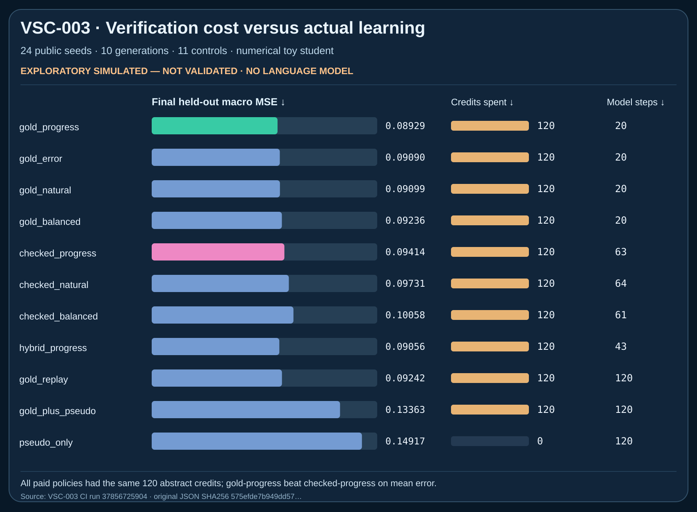
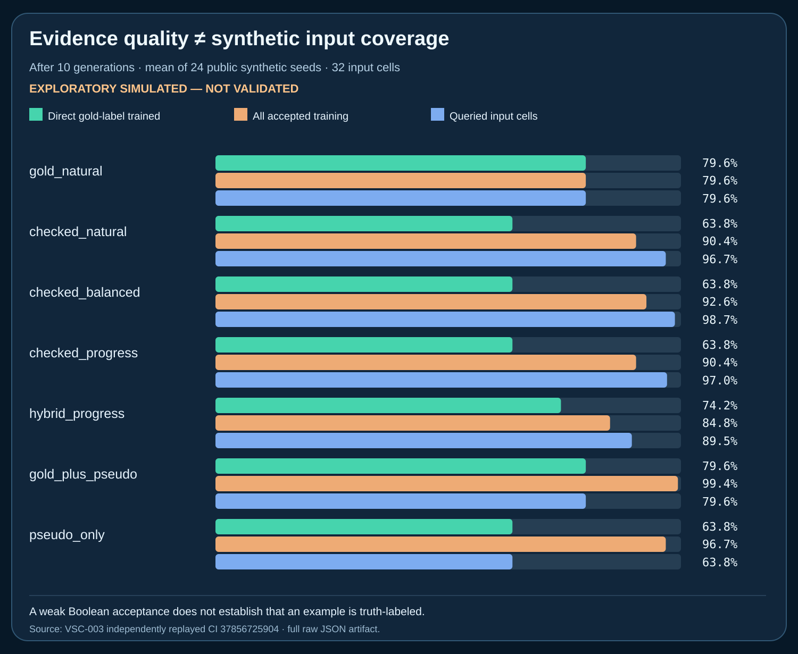

# VSC-003 — Budgeted binary verification against strong gold-label curricula

**PUBLIC EXPLORATORY SIMULATION — NOT VALIDATED.** Original full evidence and six independently replay-qualified SVG charts are preserved in the GitHub Actions artifact, linked below. The experiment does not demonstrate escape from the human-data wall, model collapse prevention, actual dollar/energy savings, or scientific novelty.

## Prospective registration and evidence provenance

- **Protocol BEFORE run:** [`experiments/vsc003/PROTOCOL.md`](../../experiments/vsc003/PROTOCOL.md), first committed `e283f07412f8da8f3df6d3ec6bf222f1c114e3de`.
- Separate implementation: [`src/origin/vsc003.py`](../../src/origin/vsc003.py); independent semantic verifier: [`tools/verify_vsc003.py`](../../tools/verify_vsc003.py); negative tests: [`tests/test_vsc003.py`](../../tests/test_vsc003.py).
- Completed source revision: `4b5fd64d11c5c0a7de9236febceb063857116d97`.
- [**CI run 37856725904**](https://github.com/holland202/veritas-origin/actions/runs/37856725904): 33 VSC-001 + 38 VSC-002 + 37 VSC-003 tests passed (**108/108**), independent VSC-003 replay passed, all historical EXP003-P0 evidence still verified.
- **Raw original evidence SHA-256** `575efde7b949dd57faeeb0377ee837c452a9f466e4f29663f7e86ff1b6c3acc3`.
- GitHub workflow artifact `vsc003-public-evidence-and-six-figures` ID `11584472029`: full original 24,516,208-byte JSON + six SVG charts. Stored only for **30 days** (until approximately 2026-11-07); preserve an independently verified archival copy before expiry. An external downloaded ZIP alone is not canonical publication.
- A separate two-seed three-generation smoke run preceded the full exploratory fixture, with its own retained CI evidence. It is not independent confirmation.
- Public deterministic seeds `20261033..20261056`, **24** seeds × **10** generations × **11** policies = **2,640 evaluated policy-generations** plus initial checkpoints.

## Research design and actual cost assumptions

Per-generation acquisition budget is **12 abstract credits**, not money, hardware-energy measurement or independently established oracle billing.

- New **true numerical label** costs 6 credits.
- A **Boolean-only weak check** costs 1 credit. It compares a noisy pseudolabel with hidden numerical truth at ±0.30, then flips 8% of Boolean outputs. It must **not supply numeric truth to the student**.
- Direct-gold policies acquire 2 true labels per generation (20 total/seed). Weak-only checked policies obtain 12 Boolean checks per generation (120/seed). Hybrid acquires 1 true label + 6 Boolean checks per generation.
- The same deterministic candidate pool with six unlabeled items/band/generation is available to every arm. All policies start with shared 32 initial true labels. Selection-validation pool has 64 true labels, and **untouched in-domain and shifted-domain final test** pools each have 192 true labels per seed. These **480 fixed shared reference labels** are not treated as free in real-world cost analysis.
- The simulator reference truth and the weak checker share the **same Python process**, and *evaluation-only true labels are logged in the post-run evidence*. This is an engineering toy with **no OS confidentiality or real-world verifier independence**.

## Public exploratory results (lower MSE is better)

Arithmetic mean over 24 public seeds; no confirmatory inference or unseen data claims.

| Policy | Final in-domain MSE ↓ | Final rare-band MSE ↓ | Final shifted-domain MSE ↓ | Abstract acquisition credits/seed | Mean student updates/seed | Mean false accept/reject |
|---|---:|---:|---:|---:|---:|---|
| `gold_progress` | **0.089287** | 0.280055 | **0.167810** | 120 | 20 | 0 / 0 |
| `gold_error` | 0.090899 | **0.263169** | 0.170469 | 120 | 20 | 0 / 0 |
| `gold_natural` | 0.090988 | 0.284888 | 0.169421 | 120 | 20 | 0 / 0 |
| `gold_balanced` | 0.092360 | 0.279073 | 0.171248 | 120 | 20 | 0 / 0 |
| `checked_natural` | 0.097305 | 0.287276 | 0.181751 | 120 | 63.96 | 4.71 / 5.33 |
| `checked_balanced` | 0.100579 | 0.292702 | 0.192849 | 120 | 61.29 | 5.17 / 4.29 |
| `checked_progress` | 0.094140 | 0.282552 | 0.181234 | 120 | 63.42 | 4.58 / 5.04 |
| `hybrid_progress` | 0.090559 | 0.280846 | 0.170710 | 120 | 42.92 | 2.17 / 2.54 |
| `gold_plus_pseudo` | **0.133634** | 0.331390 | 0.223950 | 120 | 120 | 0 / 0 |
| `gold_replay` | 0.092420 | 0.310738 | 0.170386 | 120 | 120 | 0 / 0 |
| `pseudo_only` | **0.149165** | 0.286609 | **0.251801** | **0** | 120 | 0 / 0 |

The mean initial in-domain MSE before generational training was **0.099627**. The comparison is not meaningful solely as gain over the weakest recursively pseudolabeled arm.

### Paired outcomes against gold-natural

- `checked_natural` improved the in-domain result in **8/24** seeds.
- `checked_balanced`: **6/24** seeds.
- `checked_progress`: **7/24** seeds (mean MSE **worse** than gold-natural by ≈0.003152).
- `hybrid_progress`: **12/24** seeds, mean in-domain MSE **slightly better** than gold-natural by ≈0.000429, but the mean remains **worse** than `gold_progress`. This nominal near-tie does not establish a benefit or H1 confirmation.
- `gold_progress`: **13/24** seeds (mean MSE lower by ≈0.001702).
- `gold_error`: **11/24** seeds; **rare-band result improved on 21/24 seeds** relative to gold-natural, showing a metric tradeoff.
- `pseudo_only` beat gold-natural in **0/24** seeds at final in-domain MSE, but had **0 new acquisition credits** and is not a fair replacement for a gold-informed policy.

### Anti-vacuity and verifier errors

Independent reconstruction of all weak policies showed **5,332 genuinely acceptable** and **4,748 genuinely unacceptable** proposals, with **399 false accepts** and **413 false rejects** among these 10,080 weak-check decisions. The registered anti-vacuity requirement was met: `INFORMATIVE`.

These counts reflect the deliberately injected **8% random bit-flip verifier**, not an empirical error rate of any actual classifier, API model or real-world oracle. A false accept can contaminate training; a false reject consumes a credit without training. Those costs are retained in evidence.

## Evidence-quality and provenance distinction

Gold-label training-cell diversity is recorded separately from all accepted training-example diversity and all inputs that merely received binary checks. A weak Boolean acceptance is **not** a numerical ground-truth measurement.

Average final 32-cell occupancy:

| Policy | True-gold training cells | All accepted training cells | Queried input cells |
|---|---:|---:|---:|
| `gold_natural` | 79.56% | 79.56% | 79.56% |
| `checked_natural` | **63.80%** | 90.36% | 96.74% |
| `checked_balanced` | **63.80%** | 92.58% | 98.70% |
| `checked_progress` | **63.80%** | 90.36% | 97.01% |
| `hybrid_progress` | 74.22% | 84.77% | 89.45% |
| `gold_plus_pseudo` | 79.56% | 99.35% | 79.56% |
| `pseudo_only` | **63.80%** | 96.74% | **63.80%** |

These are sampled toy input cells, not a demonstrated corpus-diversity guarantee. They expose a particular **epistemic illusion**: broad synthetic training coverage does not imply expanded independently observed truth coverage.

## Visuals

Six generator-produced SVGs are available in [run 37856725904's raw evidence artifact](https://github.com/holland202/veritas-origin/actions/runs/37856725904): in-domain trajectory, shifted-domain trajectory, rare-band trajectory, gold-labeled coverage, accepted synthetic coverage, and credit/false-check budget visualization. All graphs require the original JSON to pass the independent semantic replayer and embed **EXPLORATORY SIMULATED NOT VALIDATED**.

Two permanent tracked SVG summary figures are embedded in this report below:

## Research verdict — do not overclaim

- **SUPPORTED IN THIS LIMITED SYNTHETIC SETTING:** matched abstract acquisition cost across the seven direct/checked policies and their hybrid/replay controls; independent semantic replay; anti-vacuous imperfect feedback; false accept and rejection logging; separate evidence quality accounting.
- **NOT SUPPORTED:** pure cheap binary checking beating strong direct-gold allocation in mean final in-domain error here. The `hybrid_progress` nominal edge over `gold_natural` is too small and inconsistent for a claim of superiority, and `gold_progress` remains stronger in mean.
- **REFUTED AS A GENERAL DEVELOPMENT ASSUMPTION:** cheap verification *must* outperform buying true labels. It does not in this public toy fixture. More synthetic training examples do not automatically mean better performance.
- **NOT TESTED:** true LLM or synthetic text pretraining, externally independent or secure oracle, real prices of strong vs weak feedback, real-world shift, actual energy consumption, statistical power at fixed unseen seeds, and novelty/patent clearance.

## Next independent design review (do not retroactively tune VSC-003)

1. Investigate why cheap checks did not translate into useful accuracy; keep accepted sample value, proposal accuracy, false acceptance and feedback information gain separated.
2. Test a cost/accuracy **phase diagram** (gold/weak price ratios × verifier false-positive/false-negative rates × true proposal quality), but preregister new seed ranges and the grid first.
3. Compare adaptive query routing, abstention, and **strong labels conditional on weak-check uncertainty**, with a proper budgeted decision-theoretic baseline.
4. Improve actual oracle separation: external read-only service, deterministic request/receipt records and strict process isolation. `evaluator_true_label` must never leak to model-facing interfaces.
5. Only then run a pinned Hugging Face evidence benchmark against a real small language model, with zero overlap between training examples and the evaluation gold answers.

## Research/reuse rights and publication

Prior art includes weak-vs-strong labelers, active learning, curriculum adaptation, pseudolabel training, and verifier calibration. QUASAR (MIT) and other user research are cited without copying. Coverage-Preserving Synthesis (all rights reserved) is *concept-only*. Additional cross-repo findings are separated in [`experiments/vsc003/CROSS_SOURCE_REVIEW.md`](../../experiments/vsc003/CROSS_SOURCE_REVIEW.md).

Hugging Face and Codeberg are **read-only research candidates**, not updated mirrors at this stage; Codeberg's recent commits were reported by the user, but source was inaccessible for independent inspection. GitHub remains canonical, and all VSC research PRs remain drafts. **No original evidence was overwritten or deleted.**
